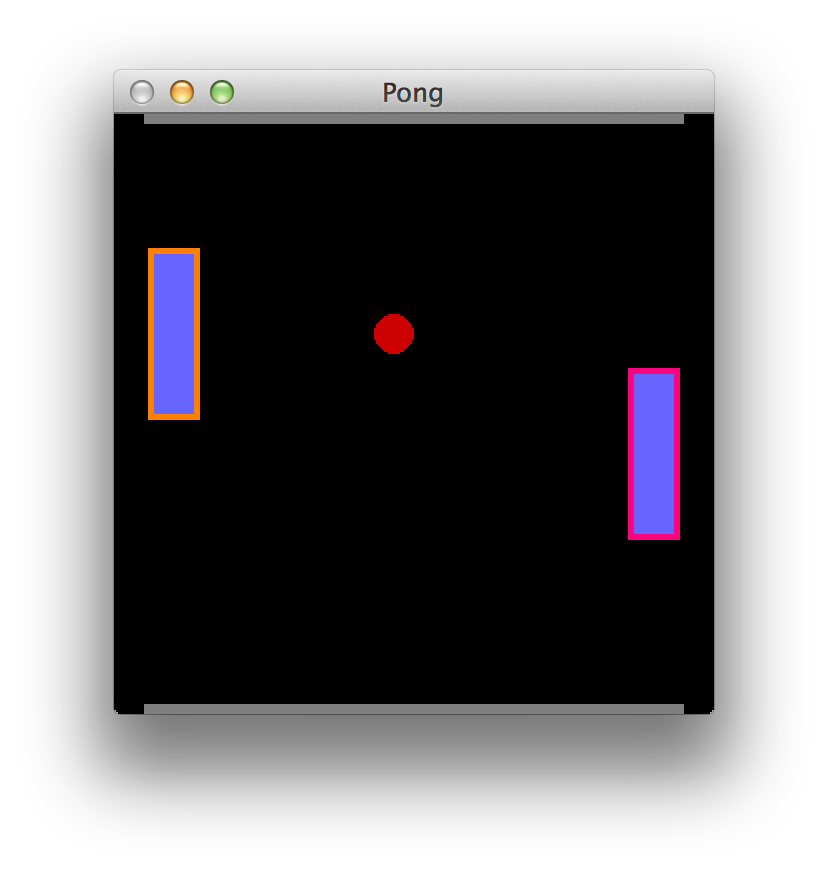
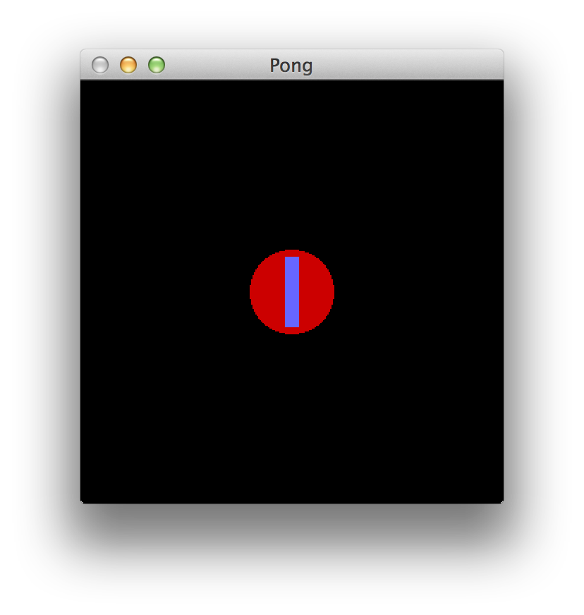
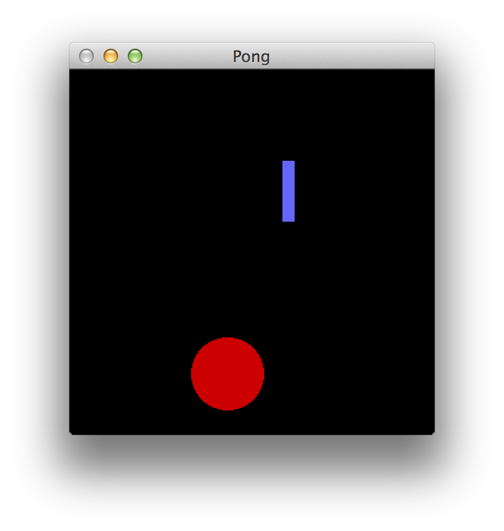

:source-highlighter: pygments
:source-language: haskell
:icons: font 
:toc: left

In this guide, we'll learn about writing packages and managing dependencies using `cabal`, a Haskell
build tool, package format, and dependency manager. We'll also get some practice reading and writing
Haskell code, with the ultimate goal of writing a working and playable game of Pong.

== The Haskell Cabal

The two tools that you'll encounter most frequently when working with Haskell code and packages are
`ghc` (the GHC Haskell compiler) and `cabal`. You've already encountered the `ghc` compiler -- it
takes Haskell source and outputs a binary executable or a module. However, GHC offers only low-level
features -- it doesn't know anything about library versions, library dependencies, extra data files you
may need to build your program. It's a compiler, and nothing else.

That's where `cabal` comes in. Cabal is hypothetically an acronym that stands for "Common
Architecture for Building Applications and Libraries", but realistically does a _lot_ more
than its name suggests. Here are a few things Cabal does:

- Cabal provides a *standard format for describing a Haskell package* (executable or library),
  including specifying dependencies, exported modules, required language extensions, test suites,
  and any other fields required to describe a Haskell package.
- Cabal provides a *build system* that can build a package described in its standard format, given
  that all dependencies of the package are installed.
- Cabal provides a *package manager*, which, given a package to install, can figure out which versions
  of all its dependencies need to be installed, and then install the package along with all
  dependencies from Hackage (the open Haskell package repository).
- Cabal provides *sandboxing functionality*, allowing packages to be installed locally to a directory,
  so that a package may be tested and built completely independently of all globally installed
  packages.
- Cabal provides a *test suite runner*, which can manage dependencies for test suites (separately
  from the library or executable) and run tests.
- Cabal provides a suite of other tools for working with Haskell tools. These tools can start
  REPLs (command-prompts) pre-loaded with all the modules in your package, create source
  distributions of your package and upload them to Hackage, generate documentation, and so on.

Extensive documentation for each may be found online or in the Cabal user manual. In this guide,
we'll introduce you to features of `cabal` through our example -- an executable package
containing a game of Pong.

=== Creating a Sandbox

Our game of pong is going to have a few dependencies. First and foremost, we'll use a library called
`gloss` for drawing all of our graphics. We could use `cabal` to install `gloss` globally, so that
all Haskell code on the computer could use it. However, with this approach we may eventually run
into problems: if I have two packages, A (which depends on `gloss-1.0`) and B (which requires
`gloss-1.2`), having a single global version of `gloss` won't work, because we cannot have both A's
and B's requirements satisfied simultaneously.

Instead of installing `gloss` globally, we're going to create a sandbox. A sandbox is a directory
in which `cabal` will (for the most part) ignore the global packages, and will instead install
packages directly to that directory. First, let's create a directory and switch to it with the
following commands:

[source,bash]
----
mkdir pong
cd pong
----

Now, let's turn this directory into a sandbox. Make sure you `cd` to your new directory before
running this, since your working directory is what will be turned into a sandbox.

[source,bash]
----
cabal sandbox init
----

Cabal should tell you that it's created a directory, with an output like this:

----
Writing a default package environment file to
/path/to/pong/cabal.sandbox.config <1>
Creating a new sandbox at
/path/to/pong/.cabal-sandbox
----
<1> `/path/to/pong` will be replaced with the absolute path to the `pong` directory you created.

If you look in that directory with `ls -a`, you should see the file `cabal.sandbox.config` and the
directory `.cabal-sandbox`. You do not need to worry about or edit either of these, but they are
important for `cabal`. All libraries and supporting files will be installed to `.cabal-sandbox`, as
long as you run the `cabal` command from the `pong` directory.

IMPORTANT: `cabal` will only use a sandbox if it is run *directly* from within the sandbox. In this
case, you _must_ be in the `pong` directory when running all subsequent `cabal` commands, otherwise
`cabal` will refuse to use the sandbox and may install packages to your global package database
instead.

=== Creating a Package

Now that we have a sandbox to play in, let's create our first package. Once again, make sure you are
running this from within the `pong` directory. This command will turn the `pong` directory into a
Haskell package directory (as well as a sandbox):
[source,bash]
----
cabal init <1>
----
<1> When you run this command, `cabal` will ask you a bunch of questions. You can safely ignore all
of these _except_ "What does this package build".

Cabal can create either an executable or a library package. Since we want a runnable game, we must
create an executable. When you run `cabal init`, one of the questions will be:

----
What does the package build:
   1) Library
   2) Executable
Your choice?
----
Make sure to enter "2" in order to create an executable package.

When `cabal` asks `Include documentation on what each field means (y/n)?`, you will want to answer
`y` (instead of `n`, which is the default), so that the generated package file will have useful
comments.

Once `cabal init` is done, it will have created two files for you: `Setup.hs` and `pong.cabal`.
`Setup.hs` allows packages to write advanced build scripts -- you do not need to worry about it for
the time being. `pong.cabal` is a configuration file which tells `cabal` everything it needs to know
about your package. Take a look at `pong.cabal`. You will see a bunch of top-level fields, like
these:

----
name:                pong <1>
version:             0.1.0.0 <2>
----
<1> This is the name of your package. If you wanted to publish it online, you would want it to be
unique in the Haskell ecosystem.
<2> This is the version of your package. Version numbers must follow a semantic versioning policy
known as the Package Versioning Policy (PVP). You do not need to worry about version numbers in this
case.

In addition to the to-level fields, you will also see a section describing the output executable:

----
executable pong <1>
  main-is:             Main.hs <2>
  build-depends:       base >=4.7 && <4.8 <3>
----
<1> `executable` is a keyword, indicating that this section describes an output executable. `pong`
is the name of this executable (it is the same as the package name by default, but does not have to
be).
<2> `main-is` tells `cabal` where to find the `Main` module and `main` function for this executable.
<3> `build-depends` lists all the dependencies of this executable. Later, we will need to modify this to
allow our executable to use the `gloss` library.

=== Beginning Development

We now have a sandbox and a package, which means we can start writing code! Begin by entering the
following simple program into `Main.hs`. Recall that the `main-is` field in `pong.cabal` requires
the file to be named `Main.hs` (unless you changed it from the default, in which case, edit the file
specified by your `main-is` field).

[source]
.Main.hs
----
module Main(main) where

main = putStrLn "Hello, World!"
----

You can now run your executable:

[source,bash]
----
cabal run
----

The output from the first time I run `cabal run` looks like this:

----
Package has never been configured. Configuring with default flags. If this
fails, please run configure manually.
Resolving dependencies...
Configuring pong-0.1.0.0...
Warning: The 'license-file' field refers to the file 'LICENSE' which does not exist. <1>
Preprocessing executable 'pong' for pong-0.1.0.0...
[1 of 1] Compiling Main             ( Main.hs, dist/build/pong/pong-tmp/Main.o )
Linking dist/build/pong/pong ...
Hello, World! <2>
----
<1> You may get a warning about the `LICENSE` file not existing. If you'd like to get rid of this
warning, just `touch LICENSE` or otherwise create an empty file named `LICENSE` to satisfy `cabal`.
<2> This is the output of your program -- clearly, it's working! If your program contained syntax or
type errors, the compilation would fail and the errors would be shown after the `Compiling Main`
line.

`cabal` keeps around old compiled data, so it does not have to re-compile all your files every time
you make a change. If you'd like to clean out its cache, you can run

[source,bash]
----
cabal clean <1>
----
<1> `cabal` generates a folder called `dist` to store all the compiled files. `cabal clean` will
remove that folder, as well as potentially doing other things.

Instead of using `cabal run` to run your executable, you can also build and run it yourself. 

[source,bash]
----
cabal build
./dist/bin/pong
----

`cabal build` will compile your program and create the `dist` directory. Your executable will be
located in `dist/bin`, and will be named `pong` (or whatever follows the `executable` keyword in
your `pong.cabal`).

Congratulations! You've created your first working `cabal` package.

== Gloss

We've got ourselves a functioning sandboxed package. We can run it with `cabal run`. It's time to
start adding functionality!

Our final goal is a game of Pong with the following properties and controls:

- When we execute `cabal run`, our program should open a game of Pong and start playing it.
- The two players should be able to control their paddles using the `w` and `s` keys (for one
  player) and the up and down arrow keys for the other.
- Gameplay should continue until the ball falls off one end. Then, the game should just stop
  updating.
- Players should be able to pause and unpause by pressing `p` and quit at any point by pressing `q`.

You'll note that we're describing a fairly minimal game of Pong -- we don't deal with menus, we
don't display a win/loss notification, we don't have any sounds, we don't have any fancy effects.
But even without this, it'll be a fully functional game! (No pun intended.)

=== Basic Drawing

Let's start off with some very basic code. First, find the documentation for the latest version of
Gloss on Hackage. This guide is written for Gloss 1.8, so some code may be out of date if you are
using a newer version of Gloss. (If you don't know where to find that, searching for "Haskell gloss
hackage" is likely to get you where you need to be.) Open the documentation for `Graphics.Gloss`,
the top-level module exported by the `gloss` library. We'll start off with the demo code very
similar to that which is included in the Gloss documentation:

[source]
.Main.hs
----
module Main(main) where

import Graphics.Gloss

window :: Display
window = InWindow "Nice Window" (200, 200) (10, 10)

background :: Color
background = white

drawing :: Picture
drawing = circle 80

main :: IO ()
main = display window background drawing
----

If you enter this into `Main.hs` and then try to `cabal run`, you'll get an error message like this:

----
Main.hs:3:8:
    Could not find module ‘Graphics.Gloss’
    Use -v to see a list of the files searched for.
----

We've forgotten to do two things. First of all, we have to install the `gloss` library into the
sandbox:

[source,bash]
---- 
cabal install gloss==1.8.* <1>
----
<1> In this command, we install `gloss` version `1.8.*`. This means it will get the newest version
such that the version number starts with `1.8`. You may want to install newer versions of Gloss, but
this guide was put together with Gloss 1.8 in mind.

Make sure you run all `cabal` commands (including the previous one) from the sandbox directory
(`pong`). Next, once `gloss` is installed, we have to tell `cabal` that our package is allowed to
use it. Find the line in `pong.cabal` that mentions `build-depends` and change it to the following:

----
  build-depends:       base >=4.7 && <4.8, gloss==1.8.* <1>
----
<1> In this example, I've fixed my `gloss` version to `1.8.*`, meaning that the package will compile
only if it can use a version number that starts with 1.8.

If we forget to modify `built-depends`, we'll get an error that looks like this:

----
Main.hs:3:8:
    Could not find module ‘Graphics.Gloss’
    It is a member of the hidden package ‘gloss-1.8.2.1’. <1>
    Perhaps you need to add ‘gloss’ to the build-depends in your .cabal file.
    Use -v to see a list of the files searched for.
----
<1> Packages are hidden to cabalized modules unless you explicitly allow them in the `build-depends`
field, like described above!

Once we get out program compiling, we will see a window containing our simple drawing (a circle on
a white background):

image::images/pong-0.png[Window with circle and white background,width=300]

Before moving on, let's break down the code that produced this circle.

As always, our `Main` module must have a `main` function. When using `gloss`, this `main` function
will always be one line. That line will depend on how much control we want over our application.
Right now, we want to do the bare minimum, and let `gloss` to the rest, and for that we use
`display`:

[source]
----
main :: IO ()
main = display window white drawing
----

The `display` function takes three arguments. To learn more about it, open the Hackage
documentation for `gloss` and find the `display` function. (If you are not experienced with reading
documentation on Hackage, you should do that _right now_. Practice reading documentation is useful!)
The documentation tells us that the three arguments to `display` are a display mode, a background
color, and the picture we'd like to draw. It also says that we can move the resulting viewport
around and quit using the Escape key.

The display mode (type `Display`) tells `gloss` how we want to display our picture. We can use the
`FullScreen` constructor to create a fullscreen application, or use the `InWindow` constructor to
create a window.

[source]
----
window :: Display
window = InWindow "Nice Window" (200, 200) (10, 10)
----

The `InWindow` constructor accepts a string as a title, a size (width and height in pixels), and a
position for the top-left corner of the window.

The color (type `Color`) we pass to `display` sets the background color.

[source]
----
background :: Color
background = white
----

Unlike `Display`, we don't have access to the constructors for `Color`. Instead, we have access to functions
such as `makeColor`, `dim`, `bright` and predefined colors such as `black`, `white`, `azure`, and
`chartreuse` which we can use to create `Color` values.

Finally, our `Picture` tells `gloss` what to draw in the window:

[source]
----
drawing :: Picture
drawing = circle 80
----

We have access to many constructors and functions to create `Picture` values. For example, the
`Circle` constructor creates a circle. Each constructor has aliases; for example, `circle` is a
function alias for `Circle`. We also have more complex functions, such as `circleSolid` or
`lineLoop`. `circle 80` creates a picture with a circle of radius 80 centered in the window. (We
could use the `translate` function to move it around if we didn't want it to be centered.)

=== Drawing Pong

Let's start off by drawing something which looks like a game of Pong. As before, start off with a
general skeleton of the application, which looks almost identical to the previous one:

[source]
.Main.hs
----
module Main(main) where

import Graphics.Gloss

width, height, offset :: Int
width = 300
height = 300
offset = 100

window :: Display
window = InWindow "Pong" (width, height) (offset, offset)

background :: Color
background = black

main :: IO ()
main = display window background drawing <1>
----
<1> We have yet to define `drawing`! We'll do that next.

Once we define `drawing`, we can get something that looks like this:

To build this image, we'll start off with a few basic drawing primitives:

- `**circleSolid :: Float -> Picture**`: Creates a solid circle with the given radius (the `Float`).
- `**rectangleSolid :: Float -> Float -> Picture**`: Creates a solid rectangle with the given width
  and height (the `Float` values).

Everything in the image above is drawn using only those two shapes. Let's try placing one of each
in an image. To combine two or more `Picture` values, we can use the `pictures` function and pass
it a list of the pictures we want to overlay:

[source]
----
drawing :: Picture
drawing = pictures
  [ circleSolid 30
  , rectangleSolid 10 50
  ]
----
If you run this, you will see a completely blank black window. Although it may seem like there's
nothing on the screen, we actually _are_ drawing the circle and rectangle; however, the default
color for all shapes is black, so we draw a black shape on a black background, and see nothing. To
fix this, we can use the `color :: Color -> Picture -> Picture` combinator function, which changes
the color of a shape and returns the new colored shape.

[source]
----
drawing :: Picture
drawing = pictures
  [ color ballColor $ circleSolid 30
  , color paddleColor $ rectangleSolid 10 50
  ]
  where
    ballColor = dark red <1>
    paddleColor = light (light blue) <2>
----
<1> `dark :: Color -> Color` is a function which takes a color as an argument and returns a darker
color.
<2> `light :: Color -> Color` is a function like `dark` which takes a color as an argument and
returns a lighter color. We can use it multiple times to create a _really_ light color.

This code will let us see the shapes we've drawn in color:

We still have a problem -- all our shapes are awkwardly jumbled together in the middle. By default,
all shapes in Gloss are drawn centered at the middle of the screen. In order to change this, you
can use the `translate :: Float -> Float -> Picture -> Picture` function, which translates a
picture by a given _x_ and _y_ distance and returns a new, translated picture. For example, let's
shift over those shapes a little bit in each direction:

[source]
----
drawing :: Picture
drawing = pictures
  [ translate (-20) (-100) $ color ballColor $ circleSolid 30 <1>
  , translate 30 50 $ color paddleColor $ rectangleSolid 10 50
  ]
  where
    ballColor = dark red
    paddleColor = light (light blue)
----
<1> We have to put negative numbers in parentheses. If we write `-10` instead of `(-10)`, the
Haskell parser assumes we are trying to use `-` as a binary operator, and will give you parse
errors or _very_ strange type errors.

As expected, the shapes are no longer in the center:

Armed with these tools, you can create the Pong game you saw earlier. The code that generated is a
little bit longer than it really needs to be for such a simple drawing for the sake of clarity, but
should be fairly straightforward to comprehend:

[source]
----
drawing :: Picture
drawing = pictures [ball, walls,
                    mkPaddle rose 120 (-20),
                    mkPaddle orange (-120) 40]
  where
    --  The pong ball.
    ball = translate (-10) 40 $ color ballColor $ circleSolid 10
    ballColor = dark red

    --  The bottom and top walls.
    wall :: Float -> Picture
    wall offset =
      translate 0 offset $
        color wallColor $
          rectangleSolid 270 10

    wallColor = greyN 0.5
    walls = pictures [wall 150, wall (-150)]

    --  Make a paddle of a given border and vertical offset.
    mkPaddle :: Color -> Float -> Float -> Picture 
    mkPaddle col x y = pictures
      [ translate x y $ color col $ rectangleSolid 26 86
      , translate x y $ color paddleColor $ rectangleSolid 20 80
      ]

    paddleColor = light (light blue)
----

Before moving on, we'd like to refactor this a little bit. In particular, when we're drawing frames
of our game, we don't want to pass around a half dozen `Float` values. We might easily get confused
as to which is which, and functions with too many parameters are annoying to work with. Instead,
we'll refactor our system into three pieces:

[source]
----
-- | A data structure to hold the state of the Pong game.
data PongGame = ...

-- | Draw a pong game state (convert it to a picture).
render :: PongGame -> Picture

-- | Initialize the game with this game state.
initialState :: PongGame
----

This way, we can easily update the game state (the `PongGame`) without worrying about how its
drawn, and we can write a `render` function without worrying about how the game state is updated.
The game state can be summarized by the following fields:

- The pong ball location.
- The pong ball velocity.
- The locations of the paddles.

We can put all of these into a single record:

[source]
----
-- | Data describing the state of the pong game. <1>
data PongGame = Game
  { ballLoc :: (Float, Float)  -- ^ Pong ball (x, y) location.
  , ballVel :: (Float, Float)  -- ^ Pong ball (x, y) velocity. <2>
  , player1 :: Float           -- ^ Left player paddle height.
                               -- Zero is the middle of the screen. <3>
  , player2 :: Float           -- ^ Right player paddle height.
  } deriving Show <4>
----
<1> This comment uses _Haddock syntax_ for documentation. Haddock is a documentation generating
system like `javadoc` or `doxygen`.  When you have a comment that starts with
a vertical bar (`|`), Haddock parses the comment using its markup syntax and stores it as an
annotation on the declaration that comes _after_ the comment. In this case, since we use a vertical
bar, the comment applies to the `PongGame` data structure.
<2> The caret (`^`) at the beginning of the comment is also Haddock syntax. While the vertical bar
attributes the comment to the following declaration, a caret attributes it to the preceeding one,
so this comment describes the `ballLoc` field.
<3> Note that this comment doesn't have a caret. However, since it's right after another comment,
it's assumed to be a continuation of the previous comment, so it also describes the `player1` field.
<4> We use `deriving Show` so that we can easily debug our program by printing `PongGame` values.

For the time being, our initial state is just an arbitrary initialiation of this data structure:

[source]
----
-- | The starting state for the game of Pong.
initialState :: PongGame
initialState = Game
  { ballLoc = (-10, 30)
  , ballVel = (1, -3)
  , player1 = 40
  , player2 = -80
  }
----

The most complex bit of this refactoring is the `render` function. It is almost identical to the
code we wrote before, but uses the `PongGame` it's provided with instead of hard-coding all the
values:

[source]
----
-- | Convert a game state into a picture.
render :: PongGame  -- ^ The game state to render.
       -> Picture   -- ^ A picture of this game state.
render game =
  pictures [ball, walls,
            mkPaddle rose 120 $ player1 game,
            mkPaddle orange (-120) $ player2 game]
  where
    --  The pong ball.
    ball = uncurry translate (ballLoc game) $ color ballColor $ circleSolid 10
    ballColor = dark red

    --  The bottom and top walls.
    wall :: Float -> Picture
    wall offset =
      translate 0 offset $
        color wallColor $
          rectangleSolid 270 10

    wallColor = greyN 0.5
    walls = pictures [wall 150, wall (-150)]

    --  Make a paddle of a given border and vertical offset.
    mkPaddle :: Color -> Float -> Float -> Picture 
    mkPaddle col x y = pictures
      [ translate x y $ color col $ rectangleSolid 26 86
      , translate x y $ color paddleColor $ rectangleSolid 20 80
      ]

    paddleColor = light (light blue)
----

.Generating Documentation with Haddock
****
In the past few code examples, you've seen a lot of `-- | Comment` and `-- ^ Comment` syntax for
Haddock comments. In this case, we're making an executable, not a library, so these are only
somewhat useful; we do not have any users that should be reading generated documentation. However,
let's this documentation anyway for the sake of practice.

Haddock will only generate documentation for exported values and types. Suppose your module only
exports the `main` function:

[source]
----
module Main(main) where

-- | Say hello world.
main :: IO ()
main = putStrLn "Hello, World!"
----

In that case, the documentation that Haddock generates will only contain a blurb about `main`,
telling you that it says "Hello, world". In order to generate documentation for a library, you must
run in your shell:

[source,bash]
----
cabal haddock
----

However, we do not have a library, so this will probably crash with an error. You must explicitly
tell `cabal` to generate documentation for the executabls:
[source,bash]
----
cabal haddock --executables
----

In order to see the documentation for `PongGame`, `initialState`, and `render`, we need to export
those from the module as well:

[source]
----
module Main(main, PongGame, render, initialState) where
...
----

Make these modifications and generate the Haddock documentation. When you run the `cabal` command,
it should give you a path to the HTML file from which you can access all the documentation (it will
be in a subdirectory of the `dist` folder called `doc`). In addition, `cabal` will tell you what
percentage of symbols in each module had documentation associated with them.

If you'd like to export the constructors and fields of a data structure, you must list them
explicitly. Instead of writing `PongGame` in the export list, you must write `PongGame(..)`. The
`..` tells it to export _all_ the constructors and fields; you can get more granularity by listing
them separately (see the manual for more info).

If you completely omit the export list and just write `module Main where`, all the values and types
in the module will be exported, so Haddock will generate documentation for all of them. If it has
no comments attached to a declaration, it will still be included in the generated documentation;
however, it will only list the name and type of the value.

****

=== Making Animations

In this section, we'll upgrade our application from a static display to an animation. This
animation will do very little; it'll move the ball, but it won't implement collision logic or
anything else.

In Gloss, animations are created using the `animate` function of type `animate :: Display -> Color
-> (Float -> Picture) -> IO ()`. This is almost identical to `display`; however, where `display`
takes a `Picture`, `animate` takes a function of type `Float -> Picture`. In other words, to create
an animation, you have to write a function which can generate a picture when given the number of
seconds that have passed since the start of the animation.

In our case, we'll use this to compute a new position for the ball, based on its initial location
and velocity. First, let's define a `moveBall` function which can create a new game state by
updating the ball position from an old one:

[source]
----
-- | Update the ball position using its current velocity.
moveBall :: Float    -- ^ The number of seconds since last update
         -> PongGame -- ^ The initial game state
         -> PongGame -- ^ A new game state with an updated ball position
----

To implement this, we use the `ballLoc` and `ballVel` fields of the `PongGame`:

[source]
----
moveBall seconds game = game { ballLoc = (x', y') }
  where
    -- Old locations and velocities.
    (x, y) = ballLoc game
    (vx, vy) = ballVel game

    -- New locations.
    x' = x + vx * seconds
    y' = y + vy * seconds
----

Then, we can use this in our `main` instead of the picture we pass to `display`:

[source]
----
main :: IO ()
main = animate window background frame
  where
    frame :: Float -> Picture
    frame seconds = render $ moveBall seconds initialState
----

=== Making Simulations

We can't do much using `animate`, since we have no information about the previous state of the
game, cannot update the state of the game, and cannot handle any interesting logic or user input.
For a little bit more power, we can use the `simulate` function, which has the following type
signature and documentation:

[source]
----

-- | Run a finite-time-step simulation in a window.
simulate :: Display -- ^ How to display the game.
         -> Color   -- ^ Background color.
         -> Int     -- ^ Number of simulation steps to take per second of real time.
         -> a       -- ^ The initial game state. <1>
         -> (a -> Picture) -- ^ A function to render the game state to a picture. <2>
         -> (ViewPort -> Float -> a -> a) -- ^ A function to step the game once. <3>
        -> IO ()
----
<1> The game state used by simulate is a type _variable_, `a`. This means that Gloss leaves the
choice of game state data structure up to the user. In our case, we want this to be `PongGame`, so
you can mentally replace all instances of `a` with `PongGame`.
<2> This is just our `render` function!
<3> The stepper function is passed the current viewport and the number of seconds that have passed
since the last update.

We can start off by just re-implementing our animation using `simulate`.

[source]
----
-- | Number of frames to show per second.
fps :: Int
fps = 60

main :: IO ()
main = simulate window background fps initialState render update

-- | Update the game by moving the ball.
-- Ignore the ViewPort argument.
update :: ViewPort -> Float -> PongGame -> PongGame <1>
update _ = moveBall <2>
----
<1> If you include this type signature in your code, you will need to import `ViewPort`, because
`ViewPort` isn't included in `Graphics.Gloss`. Import it from the `Graphics.Gloss.Data.ViewPort`
module.
<2> `update` (according to its type) takes four arguments, but in this declaration it only takes
one (the viewport) which we immediately ignore with `_`. Recall that all functions in Haskell
really take on argument, and that multi-argument functions just return functions that take more
arguments. In this case, `update` returns `moveBall`, which handles the remainder of the arguments
passed to `update`.

Next, let's implement collisions, so that our game becomes playable. We have two types of
collisions we need to implement: collisions with the side walls and collisions with the paddles.
We'll implement these by writing the following functions:

[source]
----
-- | Detect a collision with a paddle. Upon collisions,
-- change the velocity of the ball to bounce it off the paddle.
paddleBounce :: PongGame -> PongGame

-- | Detect a collision with one of the side walls. Upon collisions,
-- update the velocity of the ball to bounce it off the wall.
wallBounce :: PongGame -> PongGame
----

Bouncing off the walls is easier, because it doesn't require accessing the game state to find out
where the paddles are. We can start by detecting the collisions, given just the location of the
ball and its radius:

[source]
----
type Radius = Float <1>
type Position = (Float, Float)

-- | Given position and radius of the ball, return whether a collision occurred.
wallCollision :: Position -> Radius -> Bool <2>
wallCollision (_, y) radius = topCollision || bottomCollision
  where
    topCollision    = y - radius <= -fromIntegral width / 2 <3>
    bottomCollision = y + radius >=  fromIntegral width / 2
----
<1> Recall that the `type` keyword creates type aliases. Wherever you see `Radius`, replace with
with `Float`.
<2> Using type aliases makes your code clear and self-documenting. When looking at this type
signature, a user will know exactly what each argument represents. Using type aliases as
documentation is a common Haskell practice.
<3> You cannot directly compare a `Float` and an `Int`, so you must use `fromIntegral` to convert
`width` from an `Int` to a `Float`. We declared `width` earlier when we created the window, and we
used an `Int` because window creation requires an integral number of pixels for the dimensions.

Using `wallCollision`, we can easily implement `wallBounce`. The only tricky aspect is accessing
the game state and updating the _y_ velocity of the ball:

[source]
----
wallBounce :: PongGame -> PongGame
wallBounce game = game { ballVel = (vx, vy') }
  where
    -- Radius. Use the same thing as in `render`.
    radius = 10

    -- The old velocities.
    (vx, vy) = ballVel game

    vy' = if wallCollision (ballLoc game) radius
          then 
             -- Update the velocity.
             -vy
           else
            -- Do nothing. Return the old velocity.
            vy
----

Finally, we have to change our `update` function to use `wallBounce`. Our new `update` will consist
of two steps: first, move the ball according to the number of seconds that have passed; then, check
for wall collisions, and update based on collisions.

[source]
----
-- | Update the game by moving the ball and bouncing off walls.
update :: ViewPort -> Float -> PongGame -> PongGame
update _ seconds = wallBounce . moveBall seconds
----

In the function above, we use `(.)`, the function composition operator. The function composition
operator has type `(.) :: (b -> c) -> (a -> b) -> (a -> c)`; given an input, it runs the right
function on it, gets the output of the right function, then runs the left function on that output,
and returns the output of the left function. This is just like the hollow dot symbol you may be
acquainted from in mathematics. 

In Haskell, function composition via the `(.)` operator (as above) is used very commonly to express
a pipeline of operations. When combined with currying, it can be very clean and concise, though
some beginners may find it tough to understand at first. In the example above, we curry `moveBall`
with `seconds`, yielding a function of type `moveBall seconds :: PongGame -> PongGame`. If we
compose that with `wallBounce`, we get another function `PongGame -> PongGame`, which is exactly
what we need, sine `update` only handled the first two of three arguments it has (and left the last
argument, a `PongGame`, to be handled by its output).

[[exercise-1]]
.Exercise 1: `paddleBounce`
****
Implement `paddleBounce` to update a game state with the ball bouncing off paddles.
Then, change `update` to use `paddleBounce`. Try to use the function composition operator, as we
did above. Test your code by choosing an initial game state which causes the ball to bounce off the
wall and then a paddle. Make sure to test bouncing off both walls and both paddles.
****

=== Handling User Input

So far, we have an app that starts a pong game and then plays it forever.  However,  the players
can't move their paddles! In this section, we'll fix this issue and learn how to deal with user
input.

For games and other applications which require user interaction, Gloss provides the `play` function:

[source]
----
-- | Play a game in a window. 
play :: Display -- ^ Window to draw game in.
     -> Color   -- ^ Background color.
     -> Int     -- ^ Number of simulation steps per second of real time.
     -> a       -- ^ The initial game state.
     -> (a -> Picture)       -- ^ A function to render the world a picture.
     -> (Event -> a -> a)    -- ^ A function to handle input events.
     -> (Float -> a -> a)    -- ^ A function to step the world one iteration.
     -> IO ()
----

This function has a ton of arguments, but we have already dealt with most of them when we used
`simulate`. We have one new function of type `Event -> PongGame -> PongGame`, which handles input
events.

Find the documentation for `Event` in the Gloss documentation. You will find that it has three
constructors: `EventKey`, `EventMotion`, and `EventResize`, represnting keyboard and mouse button
presses, mouse movement, and window resizing (respectively). When our function receives an `Event`,
it can pattern-match on the `Event` data structure and respond appropriately (by modifying the
`PongGame`). The documentation will be _very_ helpful when figuring out how to construct patterns
to detect the events that you care about.

In our game, we'd like to detect keypresses. Specifically, when the user presses 'w' or 'a', the
left paddle should move up and down, respectively. In the following example, we reset the ball to
the center whenever the user presses 's':

[source]
----
-- | Respond to key events.
handleKeys :: Event -> PongGame -> PongGame

-- For an 's' keypress, reset the ball to the center.
handleKeys (EventKey (Char 's') _ _ _) game =
  game { ballLoc = (0, 0) }

-- Do nothing for all other events.
handleKeys _ game = game
----
In order to use the `Event`, `EventKey`, and `Char` symbols (and anything else related to events),
you must import `Graphics.Gloss.Interface.Pure.Game`.

In the `handleKeys` example, we ignore many aspects of the `Event`, such as the `KeyState` (`Up` or `Down`), any
`Modifier` keys that are held, and the position of the mouse at the time. For more complex
interactions, we may care about these.

In order to use `handleKeys`, we simply pass it to `play`:

[source]
----
main :: IO ()
main = play window background fps initialState render handleKeys update
----

In addition, `update` must no longer take the `ViewPort`; since we didn't use it anyways, you can
remove the `_` pattern we used to ignore it, and all will be good.

[[exercise-2]]
.Exercise 2: Pause and Unpause
****
Add the ability to pause and unpause the game using the 'p' key. You'll need to do several things:

1. Add a field to `PongGame` to store whether the game is paused.
2. Add a case to `handleKeys` to change your new field in `PongGame`. Pressing 'p' should toggle
  this field.
3. Add logic to `update` to check whether the game is paused. If the game is paused, do nothing to
  the game state and simply return the old game state; if it is unpaused, then actually update the
  game state.
****

[[exercise-3]]
.Exercise 3: Paddle Movement
****
Add the ability to move the paddles using 'w' and 's' (up and down for the left paddle) and the up
and down arrow keys for the right paddle. To do this, add cases to `handleKeys` for each of these.
You will need to look at the `SpecialKey` type to find out how to detect up and down arrow keys.
****

[[exercise-4]]
.Exercise 4: Quitting the Game (Badly!)
****
We'd like to quit the game when the ball goes out of play. However, quitting the game requires side
effects -- namely, quitting the program! Gloss provides a way to write games with side effects, but
dealing with side effects is the topic of a separate guide. Instead of using `IO` as one would in a
real program, we'll simply crash the program with an error message to quit.

For this exercise, detect when the game has ended. You will want to do this in `update`. If the
game has ended, you should return `error "Player 1 wins"` or `error "Player 2 wins"` as the new
`PongGame`. The game will then crash, printing the error message to the console.
****

== Final Steps

Congratulations! You've written a fully-functional executable package. Although a game of Pong is
unlikely to be useful to anyone, if this were a useful executable or library you would want it to
share it with the world.

The `cabal` tool makes it very easy to upload your code to Hackage. First, you must generate a
distribution package using `sdist`:

[source,bash]
----
cabal sdist
----

This will create a tarball (a bundle with the tar.gz extension) and tell you where it placed the
tarball. For example, on my system, `cabal sdists` prints the following:

----
Source tarball created: dist/pong-0.1.0.0.tar.gz
----

Then, you can upload with the following command, replacing my tarball path with whatever `cabal
sdist` gave you:

[source,bash]
----
cabal upload dist/pong-0.1.0.0.tar.gz
----

`cabal upload` will prompt you for your Hackage username and password, and then upload the file. If
you do not have a Hackage username or password, it is fairly easy to create one -- follow the
online instructions to do so. When uploading to Hackage, make sure you have set the `LICENSE` file
and field in your cabal file. Also, make sure to fill in all the fields, including a proper
description, dependencies, author, website address, source code repository, and so on -- these are
all things which you want to keep updated and correct for all your online packages. 

After you run `cabal upload`, Hackage will host your package forever. Other people will be able to
`cabal install` it (after they run `cabal update` to update their package repositories). Hackage
will try to build your package and generate documentation for it (using Hackage), so if your
package builds successfully, documentation for all exported modules should appear online a few
hours after the upload.
