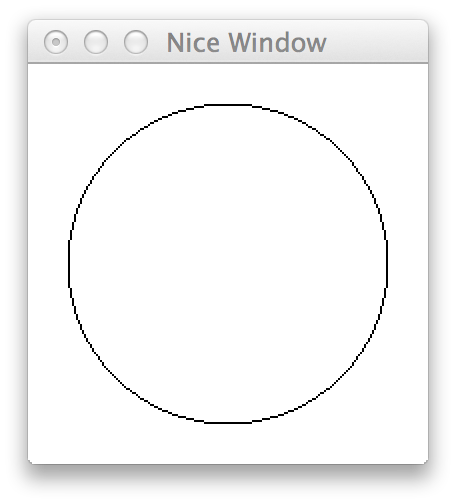

:source-highlighter: pygments
:source-language: haskell
:icons: font 
:toc: left

In this guide, we'll learn about writing packages and managing dependencies using `cabal`, a Haskell
build tool, package format, and dependency manager. We'll also get some practice reading and writing
Haskell code, with the ultimate goal of writing a working and playable game of Pong.

== The Haskell Cabal

The two tools that you'll encounter most frequently when working with Haskell code and packages are
`ghc` (the GHC Haskell compiler) and `cabal`. You've already encountered the `ghc` compiler -- it
takes Haskell source and outputs a binary executable or a module. However, GHC offers only low-level
features -- it doesn't know anything about library versions, library dependencies, extra data files you
may need to build your program. It's a compiler, and nothing else.

That's where `cabal` comes in. Cabal is hypothetically an acronym that stands for "Common
Architecture for Building Applications and Libraries", but realistically does a _lot_ more
than its name suggests. Here are a few things Cabal does:

- Cabal provides a *standard format for describing a Haskell package* (executable or library),
  including specifying dependencies, exported modules, required language extensions, test suites,
  and any other fields required to describe a Haskell package.
- Cabal provides a *build system* that can build a package described in its standard format, given
  that all dependencies of the package are installed.
- Cabal provides a *package manager*, which, given a package to install, can figure out which versions
  of all its dependencies need to be installed, and then install the package along with all
  dependencies from Hackage (the open Haskell package repository).
- Cabal provides *sandboxing functionality*, allowing packages to be installed locally to a directory,
  so that a package may be tested and built completely independently of all globally installed
  packages.
- Cabal provides a *test suite runner*, which can manage dependencies for test suites (separately
  from the library or executable) and run tests.
- Cabal provides a suite of other tools for working with Haskell tools. These tools can start
  REPLs (command-prompts) pre-loaded with all the modules in your package, create source
  distributions of your package and upload them to Hackage, generate documentation, and so on.

Extensive documentation for each may be found online or in the Cabal user manual. In this guide,
we'll introduce you to features of `cabal` through our example -- an executable package
containing a game of Pong.

=== Creating a Sandbox

Our game of pong is going to have a few dependencies. First and foremost, we'll use a library called
`gloss` for drawing all of our graphics. We could use `cabal` to install `gloss` globally, so that
all Haskell code on the computer could use it. However, with this approach we may eventually run
into problems: if I have two packages, A (which depends on `gloss-1.0`) and B (which requires
`gloss-1.2`), having a single global version of `gloss` won't work, because we cannot have both A's
and B's requirements satisfied simultaneously.

Instead of installing `gloss` globally, we're going to create a sandbox. A sandbox is a directory
in which `cabal` will (for the most part) ignore the global packages, and will instead install
packages directly to that directory. First, let's create a directory and switch to it with the
following commands:

[source,bash]
----
mkdir pong
cd pong
----

Now, let's turn this directory into a sandbox. Make sure you `cd` to your new directory before
running this, since your working directory is what will be turned into a sandbox.

[source,bash]
----
cabal sandbox init
----

Cabal should tell you that it's created a directory, with an output like this:

----
Writing a default package environment file to
/path/to/pong/cabal.sandbox.config <1>
Creating a new sandbox at
/path/to/pong/.cabal-sandbox
----
<1> `/path/to/pong` will be replaced with the absolute path to the `pong` directory you created.

If you look in that directory with `ls -a`, you should see the file `cabal.sandbox.config` and the
directory `.cabal-sandbox`. You do not need to worry about or edit either of these, but they are
important for `cabal`. All libraries and supporting files will be installed to `.cabal-sandbox`, as
long as you run the `cabal` command from the `pong` directory.

IMPORTANT: `cabal` will only use a sandbox if it is run *directly* from within the sandbox. In this
case, you _must_ be in the `pong` directory when running all subsequent `cabal` commands, otherwise
`cabal` will refuse to use the sandbox and may install packages to your global package database
instead.

=== Creating a Package

Now that we have a sandbox to play in, let's create our first package. Once again, make sure you are
running this from within the `pong` directory. This command will turn the `pong` directory into a
Haskell package directory (as well as a sandbox):
[source,bash]
----
cabal init <1>
----
<1> When you run this command, `cabal` will ask you a bunch of questions. You can safely ignore all
of these _except_ "What does this package build".

Cabal can create either an executable or a library package. Since we want a runnable game, we must
create an executable. When you run `cabal init`, one of the questions will be:

----
What does the package build:
   1) Library
   2) Executable
Your choice?
----
Make sure to enter "2" in order to create an executable package.

When `cabal` asks `Include documentation on what each field means (y/n)?`, you will want to answer
`y` (instead of `n`, which is the default), so that the generated package file will have useful
comments.

Once `cabal init` is done, it will have created two files for you: `Setup.hs` and `pong.cabal`.
`Setup.hs` allows packages to write advanced build scripts -- you do not need to worry about it for
the time being. `pong.cabal` is a configuration file which tells `cabal` everything it needs to know
about your package. Take a look at `pong.cabal`. You will see a bunch of top-level fields, like
these:

----
name:                pong <1>
version:             0.1.0.0 <2>
----
<1> This is the name of your package. If you wanted to publish it online, you would want it to be
unique in the Haskell ecosystem.
<2> This is the version of your package. Version numbers must follow a semantic versioning policy
known as the Package Versioning Policy (PVP). You do not need to worry about version numbers in this
case.

In addition to the to-level fields, you will also see a section describing the output executable:

----
executable pong <1>
  main-is:             Main.hs <2>
  build-depends:       base >=4.7 && <4.8 <3>
----
<1> `executable` is a keyword, indicating that this section describes an output executable. `pong`
is the name of this executable (it is the same as the package name by default, but does not have to
be).
<2> `main-is` tells `cabal` where to find the `Main` module and `main` function for this executable.
<3> `build-depends` lists all the dependencies of this executable. Later, we will need to modify this to
allow our executable to use the `gloss` library.

=== Beginning Development

We now have a sandbox and a package, which means we can start writing code! Begin by entering the
following simple program into `Main.hs`. Recall that the `main-is` field in `pong.cabal` requires
the file to be named `Main.hs` (unless you changed it from the default, in which case, edit the file
specified by your `main-is` field).

[source]
.Main.hs
----
module Main(main) where

main = putStrLn "Hello, World!"
----

You can now run your executable:

[source,bash]
----
cabal run
----

The output from the first time I run `cabal run` looks like this:

----
Package has never been configured. Configuring with default flags. If this
fails, please run configure manually.
Resolving dependencies...
Configuring pong-0.1.0.0...
Warning: The 'license-file' field refers to the file 'LICENSE' which does not exist. <1>
Preprocessing executable 'pong' for pong-0.1.0.0...
[1 of 1] Compiling Main             ( Main.hs, dist/build/pong/pong-tmp/Main.o )
Linking dist/build/pong/pong ...
Hello, World! <2>
----
<1> You may get a warning about the `LICENSE` file not existing. If you'd like to get rid of this
warning, just `touch LICENSE` or otherwise create an empty file named `LICENSE` to satisfy `cabal`.
<2> This is the output of your program -- clearly, it's working! If your program contained syntax or
type errors, the compilation would fail and the errors would be shown after the `Compiling Main`
line.

`cabal` keeps around old compiled data, so it does not have to re-compile all your files every time
you make a change. If you'd like to clean out its cache, you can run

[source,bash]
----
cabal clean <1>
----
<1> `cabal` generates a folder called `dist` to store all the compiled files. `cabal clean` will
remove that folder, as well as potentially doing other things.

Instead of using `cabal run` to run your executable, you can also build and run it yourself. 

[source,bash]
----
cabal build
./dist/bin/pong
----

`cabal build` will compile your program and create the `dist` directory. Your executable will be
located in `dist/bin`, and will be named `pong` (or whatever follows the `executable` keyword in
your `pong.cabal`).

Congratulations! You've created your first working `cabal` package.

== Gloss

We've got ourselves a functioning sandboxed package. We can run it with `cabal run`. It's time to
start adding functionality!

Our final goal is a game of Pong with the following properties and controls:

- When we execute `cabal run`, our program should open a game of Pong and start playing it.
- The two players should be able to control their paddles using the `w` and `s` keys (for one
  player) and the up and down arrow keys for the other.
- Gameplay should continue until the ball falls off one end. Then, the game should just stop
  updating.
- Players should be able to pause and unpause by pressing `p` and quit at any point by pressing `q`.

You'll note that we're describing a fairly minimal game of Pong -- we don't deal with menus, we
don't display a win/loss notification, we don't have any sounds, we don't have any fancy effects.
But even without this, it'll be a fully functional game! (No pun intended.)

=== Basic Drawing

Let's start off with some very basic code. First, find the documentation for the latest version of
Gloss on Hackage. This guide is written for Gloss 1.8, so some code may be out of date if you are
using a newer version of Gloss. (If you don't know where to find that, searching for "Haskell gloss
hackage" is likely to get you where you need to be.) Open the documentation for `Graphics.Gloss`,
the top-level module exported by the `gloss` library. We'll start off with the demo code very
similar to that which is included in the Gloss documentation:

[source]
.Main.hs
----
module Main(main) where

import Graphics.Gloss

window :: Display
window = InWindow "Nice Window" (200, 200) (10, 10)

background :: Color
background = white

drawing :: Picture
drawing = circle 80

main :: IO ()
main = display window white drawing
----

If you enter this into `Main.hs` and then try to `cabal run`, you'll get an error message like this:

----
Main.hs:3:8:
    Could not find module ‘Graphics.Gloss’
    Use -v to see a list of the files searched for.
----

We've forgotten to do two things. First of all, we have to install the `gloss` library into the
sandbox:

[source,bash]
---- 
cabal install gloss==1.8.* <1>
----
<1> In this command, we install `gloss` version `1.8.*`. This means it will get the newest version
such that the version number starts with `1.8`. You may want to install newer versions of Gloss, but
this guide was put together with Gloss 1.8 in mind.

Make sure you run all `cabal` commands (including the previous one) from the sandbox directory
(`pong`). Next, once `gloss` is installed, we have to tell `cabal` that our package is allowed to
use it. Find the line in `pong.cabal` that mentions `build-depends` and change it to the following:

----
  build-depends:       base >=4.7 && <4.8, gloss==1.8.* <1>
----
<1> In this example, I've fixed my `gloss` version to `1.8.*`, meaning that the package will compile
only if it can use a version number that starts with 1.8.

If we forget to modify `built-depends`, we'll get an error that looks like this:

----
Main.hs:3:8:
    Could not find module ‘Graphics.Gloss’
    It is a member of the hidden package ‘gloss-1.8.2.1’. <1>
    Perhaps you need to add ‘gloss’ to the build-depends in your .cabal file.
    Use -v to see a list of the files searched for.
----
<1> Packages are hidden to cabalized modules unless you explicitly allow them in the `build-depends`
field, like described above!

Once we get out program compiling, we will see a window containing our simple drawing (a circle on
a white background):

Before moving on, let's break down the code that produced this circle.

As always, our `Main` module must have a `main` function. When using `gloss`, this `main` function
will always be one line. That line will depend on how much control we want over our application.
Right now, we want to do the bare minimum, and let `gloss` to the rest, and for that we use
`display`:

[source]
----
main :: IO ()
main = display window white drawing
----

The `display` function takes three arguments. To learn more about it, open the Hackage
documentation for `gloss` and find the `display` function. (If you are not experienced with reading
documentation on Hackage, you should do that _right now_. Practice reading documentation is useful!)
The documentation tells us that the three arguments to `display` are a display mode, a background
color, and the picture we'd like to draw. It also says that we can move the resulting viewport
around and quit using the Escape key.

The display mode (type `Display`) tells `gloss` how we want to display our picture. We can use the
`FullScreen` constructor to create a fullscreen application, or use the `InWindow` constructor to
create a window.

[source]
----
window :: Display
window = InWindow "Nice Window" (200, 200) (10, 10)
----

The `InWindow` constructor accepts a string as a title, a size (width and height in pixels), and a
position for the top-left corner of the window.

The color (type `Color`) we pass to `display` sets the background color.

[source]
----
background :: Color
background = white
----

Unlike `Display`, we don't have access to the constructors for `Color`. Instead, we have access to functions
such as `makeColor`, `dim`, `bright` and predefined colors such as `black`, `white`, `azure`, and
`chartreuse` which we can use to create `Color` values.

Finally, our `Picture` tells `gloss` what to draw in the window:

[source]
----
drawing :: Picture
drawing = circle 80
----

We have access to many constructors and functions to create `Picture` values. For example, the
`Circle` constructor creates a circle. Each constructor has aliases; for example, `circle` is a
function alias for `Circle`. We also have more complex functions, such as `circleSolid` or
`lineLoop`. `circle 80` creates a picture with a circle of radius 80 centered in the window. (We
could use the `translate` function to move it around if we didn't want it to be centered.)

=== Drawing Pong

- Draw pong
- Add a data structure to hold game state, refactor drawing
- Note about haddock syntax

=== Making Animations
- Animate balls flying

=== Making Simulations
- Simulate balls flying
- Add collisions
- Add detecting game over

=== Handling User Input
- Switch to 'play'
- Handle user input: up, down
- Handle user input: quit
- Handle user input: pause, unpause

== Final Steps
- Generating documentation
- Packaging and uploading to hackage
- Note about documentation on hackage being auto-generated
