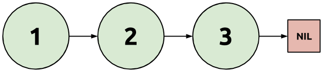

:source-highlighter: pygments
:source-language: haskell
:icons: font 
:toc: left

== Getting Started with Haskell

Time to get started! In this section, we'll go over what Haskell is, what the audience of this guide
is, and work up to our first complete Haskell program.

=== Haskell and You

You're here to learn (or learn about) Haskell. Before getting into the
nitty-gritty details of syntax and semantics, let's briefly go over who you are
and what Haskell is.

Haskell is a *general-purpose statically-typed pure functional programming
language*. Let's break that down:

- *General Purpose:* A general purpose programming language is one not designed for any specific
  task in mind. For instance, SQL and LaTeX are domain-specific languages for database queries and
  document typesetting, respectively, while languages such as Java, Python, C++, and Haskell are
  designed for any sort of programming.
- *Statically-Typed:* The meaning of a Haskell program is split into two phases -- compile time and
  run time (similar to Java and C++). At compile-time, each variable has a _type_ which indicates
  what sort of data that variable is allowed to hold. When you compile your program, Haskell
  enforces that all uses of variables respect the types those variables must have; if the program
  doesn't respect the variable types, the Haskell compiler will produce error messages. Examples of
  statically typed languages include Java and C, while languages such as Python, Ruby, and PHP are
  dynamically typed (all variable types are checked at runtime).
- *Pure*: Functions in a pure programming language (such as Haskell) will always produce the same
  output if given the same input. In other words, using a function multiple times on the same
  arguments is _guaranteed_ to produce the same value. By default, functions may not perform side
  effects (such as file I/O or mutation of mutable values).
- *Functional*: A functional language allows treating functions as values. You can create anonymous
  functions, store them in variables, pass them as arguments to other functions, and so on.
  Functional languages usually do not distinguish between statements and expressions, having only
  the latter. Statements are replaced by expressions that have some side effects when evaluated;
  however, they still return some value, like all expressions.

Haskell is a fairly unusual language. Many people liken learning Haskell to learning to program all
over again; do not be discouraged if it takes a long time and a lot of effort. For many programmers,
picking up a new language is a matter of finding an interesting project and implementing it in their
new language of choice; while this is possible with Haskell, many aspects of the language require a
more dedicated sort of study.

Now that we're acquainted with Haskell, who are you? For the purposes of this guide, you are a
somewhat experienced programmer who has worked with static type systems and functional languages and
has a few years of general programming experience under their belt. Knowing languages such as
Scheme, ML, OCaml may be helpful. If you don't quite fit this bill, you may find parts of this
guide to be very difficult. In this case, books on Haskell such as Learn You a Haskell and Real
World Haskell may be useful to supplementing your understanding.

=== Haskell Programming Tools

The Haskell language has gone through several revisions. It was initially designed to be a standard
for researchers exploring new programming language features. The first few iterations were the realm
solely of researchers; modern Haskell really began with the Haskell 98 language standard. Several
extensions were integrated into the standard later, leading to the Haskell 2010 language standard.

Although there are several Haskell compilers, GHC (the Glasgow Haskell Compiler) is by far the most
commonly used and most featureful. Many extensions to the Haskell language are implemented only in
GHC, so for the rest of this guide, you can assume that "Haskell" really means "Haskell with all the
extensions and libraries that GHC offers".

With that in mind, let's get started! Install GHC, open a text file in your favorite editor, and
enter the following program in a file called `Test.hs` (or another with the same extension):

[source]
.Test.hs
----
module Test(main) where <1>

main = <2>
  putStrLn "Hello" <3>
----
<1> Declare a module named `Test`, and export the `main` function from it. Modules should be named
the same as their filenames.
<2> The `main` function is the entry point to the program. The main module can be anything with a
`main` function.
<3> The function `putStrLn` prints a string to standard output. Strings _must_ be written with double
quotes; single quotes are used for single characters.

Next, compile this with GHC by entering the following command into your shell:

[source,bash]
ghc Test.hs -o my-program # <1>

<1> The `-o` flag tells `ghc` to write the final executable to a file called `my-program`.

Note that the precise command may differ depending on your operating system and environment. The
commands presented here should work under most Unix-like operating systems (Linux and Mac OS X), and
serve as a good template for commands for other systems.

If you run this, you should see your program printing "Hello", as expected:

[source,bash]
$ ./my-program
Hello

Congratulations! You've written your first Haskell program. This program is deceptively simple, and
in the next few sections we'll explore what exactly this program does and how it does it, as well as
look at many other features of the Haskell language.

== Values and Functions

Next, we'll dive quickly into Haskell language features. We'll look at types and how you interact
with the type system, creating global and local variable declarations, pattern matching on literals,
and defining and creating functions. Try out code snippets as you read, and try your best to work
through any error messages the compiler gives you. There's a lot of ground to cover, so if it
doesn't all sink in immediately, don't worry -- there are exercises at the end of the section meant
to ensure that you can use this material.

=== The Type System

Let's take a look at another small Haskell program:

[source]
.First.hs
----
integer = 3
str = "Hello, World!"
character = 'C'
tuple = (integer, str, character)

main = print tuple <1>
----
<1> The `print` function can be used to print many Haskell data types to the standard output. You
could also write `print integer` or `print string`; we will discuss these sorts of polymorphic
functions later. (A polymorphic function is one which operates on different types of data.)

In this program, we declare four values: an integer, a string, a character, and a tuple containing
three of these. Each of these has a different _type_. Note that _all_ values in Haskell have some
sort of type; there cannot be a value without a type. We don't always have to write what the types
are, though, because the compiler can look at how a value is used and guess what type it must have.
Although the compiler is smart enough to infer the types for this simple program, we can explicitly
annotate each top-level declaration with a type signature as well.
[source]
.Second.hs
----
integer :: Int <1>
integer = 3

str :: String
str = "Hello, World!"

character :: Char
character = 'C'

tuple :: (Int, String, Char) <2>
tuple = (integer, str, character)

main :: IO () <3>
main = print tuple
----
<1> Type annotations are written using the double-colon operator. `integer :: Int` is a type
declaration which tells GHC that the top-level variable named `integer` must be of type `Int`.
<2> The type of a tuple consists of the types of its components. Since our tuple has an integer, a
string, and a character, the type of the tuple is `(Int, String, Char)`.
<3> The type of `main` is somewhat strange, and we'll discuss this in detail eventually. All
functions which have a side effect (reading or writing files, printing to the console, and so on)
will have the `IO` type in their signature.

More likely than not, when you start programming Haskell, you will find that the type system gets in
your way. However, as you get used to Haskell and its type system, you will find that the type
system and the compiler is a huge resource. You will be able rely on the type system to catch many
common programming errors - in some ways, it will be like you have a friend watching over your
shoulder as you write code, pointing out mistakes that are obvious in retrospect.

IMPORTANT: By convention, all top-level values should have a corresponding type declaration, like in our second
program. This improves the quality of error messages and forces you to double-check your types as
you write code. Advanced programmers will actually start by writing all the top-level type
declarations and filling out the values second.

In order to use the type system, you can annotate values with types and write type declarations. In
the example program above, we wrote a type declaration for every top-level value declaration we had.
However, we could also have _annotated_ every value:
[source]
.Third.hs
----
integer = 3 :: Int <1>
str = "Hello, World!" :: String
character = 'C' :: Char
tuple = (integer, str, character) :: (Int, String, Char)
main = print tuple :: IO ()
----
<1> Type _annotations_ are of the form `value :: type`, with the double-colon coming directly after
the value itself. If you want to annotate only part of an expression, make sure you put parentheses
around the whole thing. For instance, `1 + 2 :: Int` is equivalent to `(1 + 2) :: Int`, so if you
wanted to only annotate the 2, you would write `1 + (2 :: Int)`.

.Polymorphic Numbers
****
Numeric literals in Haskell are polymorphic. That means that when you write the literal `3`, that
could be a `Int`, `Integer` (those are Haskell's big integers), `Float`, `Double`, or a whole host
of other things. As a result, you may sometimes need to annotate literals with the type that you
intend for them to be in order to avoid type ambiguity. Also, if you ever need to convert an integer
to a floating point number, the function `fromIntegral` will come in handy, allowing you to write
type converting expressions such as `fromIntegral (3 :: Int) :: Float`.
****

=== Local Variable Bindings

We've already seen top-level value declarations along the following lines:

[source]
integer = 3

However, there's no reason that these values must be expressed using just literals, even if they
aren't functions. For example, we can use a `where` clause to use some local variable bindings:

[source]
----
integer = one + two
  where <1>
    one = 1 <2>
    two = 2
----
<1> The `where` comes _after_ the declaration it's attached to, and is indented by two spaces.
<2> The bindings declared in the `where` block must be aligned; `one` and `two` both start
at the same level of indentation. Both must be indented past the `where` itself as well.

Computing the values of `one` and `two` cannot have side effects, so it is unimportant what order
they are declared in. In other languages, you might say that the variable `two` is created after the
variable `one`, but in Haskell that is irrelevant -- the two variables are not ordered in any way,
and are just evaluated when their values are needed.

In addition to providing `where` blocks which can be attached to declarations, 
Haskell provides `let .. in` blocks that together form an expression. For example, we could rewrite
the example above as follows:
[source]
----
integer =
  let one = 1 
      two = 2 <1>
    in one + two <2>
----
<1> The variable bindings are once more aligned. The identifiers `one` and `two` must start
at the same column in order to be part of the same `let` block.
<2> We need the `in` keyword after the bindings. The indentation does not matter; it can even be on
the previous line.

`let` is used when you are creating an expression, and `where` is used when you have a declaration
you can attach the `where` to; other than that, the meaning of these two blocks is almost identical.

Both `let` and `where` blocks allow for type declarations, so the following code would also be
valid:
[source]
----
integer1 =
  let one :: Int
      one = 1 in
    one + 3

integer2 = one + 3
  where
    one :: Int
    one = 1
----

.Haskell Layout
****
At this point, you may be a little bit confused about exactly how far you need to indent each line
of code. Although it seems like there are a lot of rules, Haskell actually uses a very simple
system. In addition to supporting indentation, Haskell allows using curly braces and semicolons as
delimiters. The meaning of the following code should be clear:

[source]
----
let {x = 3; z = 5} in x + z
----

In order to convert this into a indentation-based (layout) block, follow two simple rules:

1. Semicolons are converted into newlines.
2. Remove braces, replacing them with indentation. Every clause in a braced block must start at the
same level of indentation. All expressions in the same group must have their starting character be
exactly aligned.

Using those two rules, the above code can be rewritten to the following variants, as well as others:

[source]
----
let x = 3
    z = 5 in x + z

let x = 3
    z = 5
in x + z

let
 x = 3
 z = 5
in x + z
----

If you remember these two simple rules, Haskell rules for layout of indented blocks will make sense.
****

=== Defining Functions

In Haskell, functions are defined exactly like the numbers and strings we've already seen, with a
few bits of syntactic sugar to make it easier. For instance, a function that adds one to an integer
can be written as follows:

[source]
----
addOne :: Int -> Int <1>
addOne =
  \int -> <2>
    int + 1 <3>
----
<1> The type of a function that takes a single argument of type `a` and returns a value of type `b`
is written as `+a -> b+`. Thus, since `addOne` takes an `Int` and returns an `Int`, the type of
`addOne` is `+Int -> Int+`.
<2> Anonymous functions are written as `+\argument -> expression+`. The backslash is the beginning of
the anonymous function (of the lambda), and the arrow `+->+` separates the argument from the return
value.
<3> The expression to the right of the `+->+` arrow can use the arguments. In this case, since `int`
is the argument, and the return value is `int + 1`, this function returns an integer one greater
than the integer it was given as an argument.

However, writing all functions as anonymous functions would be very tedious. To avoid this, you can
simply put the argument to the function on the left hand side of the equal sign, yielding the
following cleaner code:
[source]
----
addOne :: Int -> Int <1>
addOne int = int + 1
----

A complete program using function declarations of this style follows:
[source]
.Functions.hs
----
module Main where

timesThree :: Int -> Int
timesThree x = x * 3 

sayHello :: String -> String
sayHello target = "Hello, " ++ target ++ "!" <1>

main = print (timesThree 3, sayHello "World")
----
<1> The only unfamiliar thing in this program should be the $$++$$ operator. The $$++$$ operator has
type `+String -> String -> String+`, and can be used to concatenate two strings. For example, `"a" ++
"b"` is equal to "ab".

=== Functions of Multiple Arguments

In Haskell, _all_ functions are single-argument functions. Every function takes one argument and
returns one value. However, we can still _emulate_ multi-argument functions! For example, consider
the following function, which adds two numbers:

[source]
----
add :: Int -> (Int -> Int) <1>
add =
  \first ->
    \second -> <2>
      first + second
----
<1> The input to `add` is a single number, an `Int`. The output is function of type `+Int -> Int+`,
which is a function that takes a second number (also an `Int`) and returns some `Int` output (their
sum).
<2> The output of the first anonymous function is a second anonymous function. The output of the
second anonymous function uses arguments to both levels of functions (`first` and `second`).

When we pass an `Int` to `add`, we get back another function. If we pass another `Int` to that
function, we get the sum of the two integers as a result:

[source]
----
func :: Int -> Int
func = add 1

three :: Int
three = func 2
----

In this regard, Haskell's single-argument functions allow us to easily emulate multi-argument
functions. In order to make this easier, Haskell provides us with syntactic sugar for these
anonymous function declarations, just like it does for single-argument functions. Thus, we can write
the function and it's use as follows:
[source]
----
add :: Int -> Int -> Int <1>
add first second = first + second <2>

three :: Int
three = add 1 2 <3>
----
<1> We don't need parentheses around the output `+Int -> Int+`; those are implied. Another way of
saying this is that the `+->+` operator is right-associative.
<2> In this code, we've replaced the two anonymous functions with a single declaration. However, the
meaning is unchanged. We can still write `add 1 :: Int -> Int` and store that into a variable,
applying it to the second argument somewhere else in the code (or not at all). The process of
supplying less than the full set of arguments to a function and getting back a function expecting
the rest of the arguments is called _currying_, and is used very frequently in Haskell.
<3> We don't need the parentheses around `add 1`, as they are implied. Function application is
left-associative, meaning that elements are grouped on the left. For example, the expression `a b c
d` is interpreted as `((a b) c) d`.

=== Pattern Matching and Branching

Using simple operators such as `+` and `*` is all well and good, but most real-world functions
involve a lot of decision-making and branching based on the values they are passed as arguments. In
Haskell, this decision-making can take a number of forms.

The most common form is known as _pattern matching_. Pattern matching allows you to test whether
your data conforms to some sort of fixed pattern in its values or structure, and execute different
code depending on the pattern it matches. For example, in the following classic example, we pattern
match on the argument to determine what to do:

[source]
----
fib :: Int -> Int <1>
fib 0 = 1 <2>
fib 1 = 1
fib n = fib (n - 1) + fib (n - 2) <3>
----
<1> Always remember to include a type declaration for all your top-level values and functions!
<2> In this piece of our declaration, we've replaced the argument to `fib` with a literal pattern.
If the argument to `fib` is equal to 0, then this part of the declaration is executed. Otherwise, it
passes through to the next declaration. This is somewhat like a `switch` statement in some
imperative languages, with the caveat that exactly one of the branches is taken.
<3> The last declaration uses a variable `n` as the pattern. When you see a variable in a pattern,
it will match _anything_, and bind the value that it matched to that variable. Thus, it resembles
the function declarations we saw earlier.

Pattern matching works on things besides numeric literals as well, such as strings, characters, and
tuples, as demonstrated by the following ridiculous function:

[source]
----
match :: Int -> String -> (Int, (Int, String)) -> Int
match 0 "Hello" (1, (2, "No")) = 300 <1>
match k "x" (1, (2, "No")) = k <2>
match 0 "x" (2, _) = 500 <3>
match _ _ _ = -1
----
<1> We can pattern match on several arguments at once.
<2> We bind `k` to the value of the first argument.
<3> An underscore `_` is used to match any pattern and ignore its value.

In addition to pattern matching in the function declaration, Haskell provides the `case .. of`
statement for pattern matching:

[source]
----
cases :: (Int, Int) -> String
cases tuple =
  case tuple of <1>
    (0, 0) -> "Nones"
    (1, 1) -> "Ones"
    (1, _) -> "First one"
    _ -> "Other"
----
<1> The specific indentation follows the Haskell layout rules. The `case` often appears on the same
line as the function declaration, but the beginnings of the different cases must be indented past
the `case` and aligned.

In addition to pattern matching (which tests for structure equality), Haskell provides _function
guards_ for deciding between different pieces of a function declaration. For example, a comparison
function could be written like this:

[source]
----
comparison :: Int -> Int -> String
comparison a b <1>
  | a < b = "Less" <2>
  | a > b = "Greater"
  | otherwise = "Equal" <3>
----
<1> Instead of immediately declaring the result, divide it into several cases, each prefixed by `|`.
<2> Each case starts with `|`, followed by a condition (an expression of type `Bool`), then the rest
of the declaration.
<3> The `otherwise` keyword is used for the fall-through default case.

Finally, if none of these styles match what you want to do, Haskell provides a conventional `if ..
then .. else` statement. Since the result of this statement is an expression, the `then` and `else`
must _both_ be present, and the results must have the same type (otherwise the entire `if` would not
be well-typed). Thus, the `comparison` function could also be written using `if` statements:

[source]
----
comparison :: Int -> Int -> String
comparison a b =
  if a < b
  then "Less"
  else
    if a > b
    then "Greater"
    else "Equal"
----

The Haskell `if` statement is much closer to the ternary `?:` operator from C-style languages than
it is to the traditional `if` statements found in most languages.

You've now been introduced to most of the various control structures that Haskell provides. The
control structures provided are fairly simple; there is no looping or object-orientation. There are
a few more advanced language features we will look at in the future (type-classes, list
comprehensions), but the ones here are more than enough to get you started. In the next section,
we'll take a break from control structures and look at creating and using our own custom data types.

== Declaring and Creating Data Types

Haskell shines in creating and managing structured data. The most common way to create a new data
type is using the `data` keyword:

[source]
----
data MyType = Constructor Int
----

This declares a new type named `MyType`. `MyType` is a type, like `Int` or `String` (_not_ a value,
so you cannot write something like `value = MyType`.) It also creates a single function
`Constructor` of type `Int -> MyType`; these functions are commonly called _constructors_.
However, be careful -- they are not like constructors in Java or C++; they do not do any
initialization or processing. In the case above, we only have one constructor named `Constructor`,
and it holds an `Int`. Thus, the simple type `MyType` is just a wrapper that holds an `Int` value.
We can create values of type `MyType`, pattern match on them, and deconstruct them to get the `Int`
out of them:

[source]
.MyType.hs
----
module MyType(main) where

data MyType = Constructor Int
  deriving Show <1>

makeValue :: Int -> MyType
makeValue integer = Constructor integer

incValue :: MyType -> MyType
incValue (Constructor integer) = Constructor (integer + 1) <2>

main = print value2 <3>
  where
    value1 = makeValue 3
    value2 = incValue value1
----
<1> Don't worry about the `deriving Show` just yet. We need this in order to be able to output the
data structure as a `String`, which allows us to use `print`.
<2> We pattern match on the `Constructor` constructor. This allows us to extract the `Int` from the
`MyType` and bind it to `integer`, which we then use to create a new `MyType`.
<3> If we didn't have `deriving Show`, this `print` would result in a type error.

=== Sum and Product Types

The `data` keyword is quite versatile. For example, constructors can have multiple arguments. Like
before, the types of the arguments are spelled out in the `data` declaration:

[source]
----
data SecondType = SecondType Int String Char
----

In this declaration, we've created a type called `SecondType`. It has one constructor, also called
`SecondType`, which takes an integer, a string, and a character. The use of this multi-argument
constructor and type is very similar to the single-argument case:

[source]
.SecondType.hs
----
module SecondType(main) where

data SecondType = SecondType Int String Char

makeValue :: Int -> MyType
makeValue integer = SecondType integer "Hello!" 'X'

main = case makeValue 3 of <1>
  SecondType _ string _ -> print string
----
<1> We can use `case` statements to pattern match on our constructors. In this case, we only have
one pattern, and we just use it to extract the `String` from the `SecondType` value.

.Product Types
****
Types with a single constructor and multiple arguments (such as `SecondType`) are often called
_product types_. This name stems from mathematics. Suppose you have some type `Letter`, which is any
upper-case letter from A to Z, as well as a type `Digit`, which represents a digit between zero and
nine. Then, suppose we declare the following type:

[source]
----
data LetterAndDigit = LetterAndDigit Letter Digit
----
This type contains both a `Letter` and a `Digit`. In Boolean algebra, the `and` operation is
commonly denoted as multiplication, so the `LetterAndDigit` type can be viewed as the product of the
two types. 

In addition, consider the _number_ of possible values of the `Letter`, `Digit`, and
`LetterAndDigit` types. There are 26 letters and 10 digits. Since `LetterAndDigit` has one of each,
there are 260 (26 times 10) possible values of type `LetterAndDigit`; the number of inhabitants of a
product type is the product of the number of inhabitants of its constituents. (An inhabitant of a
type is one possible value of that type.)
****

The `data` keyword also allows you to create types with _multiple_ constructors. Each constructor
requires its own set of constituent types. If you've worked with C or C++, you can think of
multi-constructor types as a sort of well-typed union. In order to create multiple constructors, you
delimit the constructors with a vertical bar `|`:

[source]
----
data Third = Third1 Int | Third2 String | Third3 Char Char
----
This type (called `Third`) has three constructors, `Third1`, `Third2`, and `Third3`. They take an
integer, a string, and two characters, respectively. 

We can create values of type `Third` in three different ways, and we can pattern match on
multi-constructor data types to find out which constructor was used:

[source]
.Third.hs
----
module Third(main) where

data Third = Third1 Int | Third2 String | Third3 Char Char

value1 :: Third
value1 = Third 3

value2 :: Third
value2 = Third2 "Hello"

value3 :: Third
value3 = Third3 'A' 'B'

main = case value3 of
  Third1 _ -> print "Integer"
  Third2 string -> print string
  Third3 c1 c2 -> print [c1, c2] <1>
----
<1> A string is just a list of characters, so the value `[c1, c2]` is just a string made up of the
two constituent characters `c1` and `c2`. We will discuss lists in more depth soon!

.Sum Types
****
Types that have multiple constructors are often called _sum types_. The origins and reasons are
similar to those for product types. Consider the following type, which stores either a `Letter` or a
`Digit`:

[source]
----
data LetterOrDigit = StoreLetter Letter | StoreDigit Digit
----

In Boolean algebra, the `+` symbol commonly denotes the `or` operation. When using sum types, there
are several constructors, and each value must be one _or_ the other, as in the above example.
Also, if we count the number of inhabitants of a sum type, it will be a sum of the number of
inhabitants of the constituent types. In this case, there are 36 possible values of type
`LetterOrDigit`: 26 values which use the `StoreLetter` constructor, and 10 values which use the
`StoreDigit` constructor.
****

=== Parametric and Recursive Types

Some types, such as our hypothetical `Letter` or `Digit` types, store a fixed type and amount of
data (in this case, one letter and one digit). However, sometimes we need to store different types
of data, or different amounts of data. 

In order to store different _types_ of data, Haskell's types are allowed to be _parametric_.
Parametric types are similar to various generic programming systems in imperative languages
(generics in Java, some uses of templates in C++, and so on). For example, the following type
represents a "nullable" value of some type `a`:

[source]
----
data Maybe a = Nothing | Just a
----
This type has one type parameter, `a`. The parameter is a _type variable_ and comes
after the type name, just like an argument to a function. Like normal variables, type
variables _must_ start with a lowercase letter or underscore.

This type also has two constructors. The first, `Nothing`, is similar to `null`, `nil`, or `None`
from other languages, and represents the absence of a value. The second constructor is just a
wrapper around a value of type `a`, and represents the fact that a value _does_ exist.

We can make values of this type like this:

[source]
----
-- Can work for any type 'a', so we leave it unspecified.
nothing :: Maybe a
nothing = Nothing

something :: Maybe Int
something = Just 3

nothingInSomething :: Maybe (Maybe Int)
nothingInSomething = Just Nothing
----

Using type parameters, we can create types that represent abstract ideas and data structures, such
as nullable values, lists, or trees.

Note that in order to make the most of these data structures, you will sometimes need to create
_recursive_ data structures. For example, a binary tree can be represented as follows:

[source]
----
data BinaryTree a = Leaf a | Branch a (BinaryTree a) (BinaryTree a)
----
This tree has a value of type `a` at every node. Each node is either a `Leaf` (in which case it is a
terminal node) or a `Branch` (in which case it has two subtrees). However, note that the subtrees
are also of type `BinaryTree a`. This type is recursive, as each binary tree can store yet another
binary tree, which allows for trees of arbitrary depth. We will deal with a similar data structure
extensively towards the end of this guide.

=== Other Ways of Making Types

In a typical Haskell application, some types will be large, with multiple branches separated by `|`
and multiple constituents in each branch. However, many types will be small wrappers around existing
types, just meant to be used for type safety. For example, in order to prevent someone from adding
together an age and a weight, you might want to create separate data types for each:

[source]
----
data Age = Age Float
data Weight = Weight Float
----

If we write `1.0 + 2.0`, the compiler will produce `3.0`, regardless of what the `1.0` and `2.0`
were meant to represent. However, if we try to write `Age 1.0 + Weight 2.0`, we will get a type
error, because the operation we are trying to do is meaningless. In order to facilitate simple
wrapper types like `Age` and `Weight`, Haskell provides the `newtype` keyword:

[source]
----
newtype Age = Age Float
newtype Weight = Weight Float
----

A `newtype` declaration is identical to a simple `data` declaration. However, there can only be one
constructor with one constituent type in it, which enforces the fact that `newtype` types are just
wrappers. In exchange for this restriction, the compiler guarantees that there will be no runtime
cost associated with using a `newtype` -- unlike `data`, the constructors and de-constructors are
guaranteed to be optimized away by the compiler.

Now that you've familiarized yourself with data types in Haskell, read through the following short
application that deals with managing a list of people:

[source]
.People.hs
----
module People(main) where

-- Wrappers for numerical types.
newtype Age = Age Float
newtype Weight = Weight Float
  deriving Show <1>
newtype Address = Address String

-- A data type representing a person.
-- A person is either an adult, or a child.
-- Children must have a parent.
-- Their address is the same as their parent's.
data Person = Adult Age Weight Address
            | Child Age Weight Person

-- A small set of people.
charlie, victoria, john :: Person <2>
charlie  = Adult (Age 50) (Weight 150) (Address "Lombard St")
victoria = Adult (Age 52) (Weight 180) (Address "Deuce Ave")
john = Child (Age 10) (Weight 90) charlie

-- Extract the weight from a Person value.
getWeight :: Person -> Weight
getWeight (Adult _ w _) = w
getWeight (Child _ w _) = w

-- Print all the weights.
main = 
  print (getWeight charlie, getWeight john, getWeight victoria)
----
<1> `newtype` declarations need `deriving Show` in order to be printed, just like `data`.
<2> When declaring multiple values of the same type, you can put them in the same type declaration.
Only do this if the values are intricately related and it makes sense to declare them together.

This small program does a lot! However, we can shorten it and make it a bit clearer using _record
types_. Take a look at `getWeight` in the program above: this is effectively boilerplate. We extract
the same field from each constructor, causing us to duplicate code for every constructor we have.
Also, if we wanted to manipulate age and address, we'd have to write a function that looked more or
less identical for each of those fields. Instead of writing these ourselves, we can give the
constituent types of each constructor a name, and let Haskell generate these functions for us.
Using record notation, we could rewrite the `data` declaration as follows:

[source]
----
data Person = Adult {
        age :: Age,
        weight :: Weight,
        address :: Address
    } | Child {
        age :: Age,
        weight :: Weight,
        parent :: Person <1>
    }
----
<1> An additional benefit of this is that the code is much more self-documenting. We no longer need
a comment to tell us that the `Person` in the `Child` constructor is the parent, as we've given each
field of the record an informative name.

To use our new functionality, we can simply get rid of `getWeight` and replace with just `weight`:

[source]
----
main = print (weight charlie, weight john, weight victoria)
----

We can still pattern match on records and create new values in the same way we did before. However,
we can _also_ pattern match on fields themselves. We could write the following function to retrieve
a person's location:

[source]
----
location :: Person -> String
location Adult{address = addr} = addr <1>
location Child{parent = adult} = location adult
----
<1> To pattern match on a record, write the constructor name (`Adult`) followed by fields in braces.
The field name goes to the left of the `=`, and the variable or pattern you'd like to bind it to
goes on the right.

We can use a similar syntax for creating new records. For example, we could define `charlie` as
follows:

[source]
----
charlie :: Person
charlie  = Adult {
      age = Age 50,
      weight = Weight 50,
      address = Address "Lombard St"
    }
----

This is a little bit more verbose, but can be clearer for complex data types and will not break if
you add more data types somewhere in the middle of the product type.

== Lists

At this point, we can begin looking at some real-world applications and uses of Haskell. In this
section, we'll go through one of the most basic data structures used in functional programming - the
linked list.

=== Linked Lists

A linked list is a list in which each element is stored in its own node. Each node also has a
pointer or reference to the next node in the list. 

The diagram above shows a linked list with three nodes. The first node contains a one and a link to
the second node. The second node contains a two, and a link to the third node. The third node
contains a three, and a link to the fourth and last node. The fourth node is a special symbol "Nil"
indicating the end of the list. (An empty list would be represented as just the symbol "Nil").

We could encode a recursive data structure like this one in Haskell as follows:

[source]
----
data List a = Nil <1>
            | Node a (List a) <2>
----
<1> The ending symbol (and empty list) is a single no-argument constructor called "Nil".
<2> Each node has a value (the `a`) and a link to the remainder of the list (the `List a`). The `a`
is called the _head_ and the `List a` is called the _tail_ of the list.

We could then create the list containing 1, 2, and 3 as follows:

[source]
----
elements :: List Int
elements = Node 1 (Node 2 (Node 3 Nil))
----

However, because linked lists are so common in functional programming, Haskell has special syntax
for lists. Instead of `Nil`, you write `[]` (the empty list). Instead of `Node value next`, you
write `value : next`, with `:` acting as an infix data constructor. In addition, lists of known
elements can be written naturally with the elements inside braces, separated by commas. The list
of the numbers 1, 2, 3 would just be written `[1, 2, 3]`. Instead of `List a`, the type of a
list of `a` values is `[a]`. All of the following options are valid and semantically identical:

[source]
----
elements :: [Int]
elements = [1, 2, 3]

elements :: [Int]
elements = 1 : 2 : 3 : []

elements :: [Int]
elements = 1 : [2, 3]
----

For the case of numbers, you can also write `[x..y]` to create a list of integers from
`x` going to `y`. For example, the list of all integers between one and ten can be written as
`[1..10]`. The notation `[x, x'..y]` indicates a list of values starting at `x`, incrementing by `x'
- x`, and going until `y`. For example, all even numbers up to 10 can be written as `[0, 2..10]`:

[source]
----
toTen :: Int
toTen = [0..10]

evensToTen :: Int
evensToTen = [0, 2..10]

oddsToTen :: Int
oddsToTen = [1, 3..10]
----

=== Pattern Matching on Lists
In order to work with lists, we use pattern matching, like with most data structures. For example,
we can use pattern matching to extract the head and tail of a list:

[source]
----
head :: [a] -> a
head (x:xs) = x <1>
head [] = error "empty list" <2>

tail :: [a] -> [a] <3>
tail (x:xs) = xs
tail [] = error "empty list"
----
<1> The pattern `x:xs` mirrors the way lists are created. `x` is bound to the head (first element), and `xs` is
bound to the tail (the remainder of the list).
<2> We can't take the `head` of an empty list, since it has no first element. `error` is a special
function which throws an exception and crashes the program. So make sure you don't take the `head`
of an empty list!
<3> Note the type signature -- we take _and_ return a list. Like `head`, `tail` throws an exception
on an empty list.

We can also do somewhat more advanced pattern matching. For example, suppose we have a two-element
list `[1, 2]` and we want to compute the sum of the two elements. Here are two ways we could do that:

[source]
----
list :: [Int]
list = [1, 2]

sum1 = a + b
  where
    [a, b] = list <1>

sum2 = a + b
  where
    a:b:_ = list <2>
----
<1> Patterns that use square brackets require that the list be of length _exactly_ two. A three-element list
would cause a pattern-match failure. (To match on a three-element list, you would use a pattern like
`[a, b, c]`.)
<2> In this case, we use an underscore `\_` to ignore everything past the second element. In a three
or more element list, everything beyond the second element would just be ignored. If we wanted to
match *only* two-element lists, we could write `a:b:[]` instead of `a:b:_`.

=== Higher-Order List Processing

Next, we'll take a look at some of the fundamental operations available on lists. These are the
bread and butter of functional programming; as you continue with Haskell, you'll encounter these
functions on a daily basis.

Suppose you declare a list of integers:

[source]
----
ints :: [Int]
ints = [1..5]
----

We'd like to perform two steps:

1. Take the square of every integer, and get a list of squares.
2. Compute the sum of all these squares.

We'll handle each of these steps in order.

==== Map

In order to take the square of every integer, we'll define the following function, which _maps_ a
function over every element of a list:

[source]
----
map :: (a -> b) <1>
    -> [a] <2>
    -> [b] <3>
----
<1> As the first argument, `map` takes a function that transforms an `a` into a `b`.
<2> As the second argument, `map` takes a list of `a` s.
<3> `map` applies the function to every element of the list and outputs the list of resulting `b` s.

Functions like these are known as _higher-order functions_. (Some languages also
call these types of functions "functors", but Haskell uses the word "functor"
to mean something completely different.) A higher-order function is a function takes a function as
an argument (like `map`, which has another function as its first argument) or returns a function as
the result. All Haskell multi-argument functions return functions as results (due to currying), so
most of the time the term higher-order function refers to functions which take other functions as
arguments.

In a standard imperative language, you might use a `for` or `while` loop to implement this `map`
function. However, Haskell doesn't have loops, and instead you must use recursion in cases like
these. When beginning to write functions, break them up into separate declarations for the different
input they may receive. In this case, start by considering what `map` must do if it gets an empty
list as the second argument:

[source]
----
map f [] = []
----
Clearly, since there are no `a` 's to process, the output cannot have any `b` 's, so `map` must return
an empty list.

The alternative to an empty list is one which has something in it. In that case, we pattern match on
the head and the tail of the list:
[source]
----
map f (x:xs) = f x : map f xs
----

To convert the `x` (of type `a`) to type `b`, we apply `f` (of type `a -> b`), yielding `f x` (of
type `b`).  Then, since we want to construct a _list_ of `b` 's, we apply `map` to the remainder of the list. We
conjoin these two pieces into one list using the cons operator, `:`. Thus, the entire function with
our desired usage can be written as:

[source]
----
map :: (a -> b) -> [a] -> [b]
map _ [] = []
map f (x:xs) = f x : map f xs

ints :: [Int]
ints = [1..5]

squares :: [Int]
squares = map (^2) ints <1>
----
<1> The `(^2)` syntax is a special syntax for using operators as functions. Whenever you have a
binary operator, you can put it in parentheses in order to turn it into a function. If you just put
it in parentheses, like `(^)`, it will become a binary function; however, you can put a value on the
left or right side of the operator in order to pre-supply that value and create a unary function. In
this case, `(^2)` is equivalent to the anonymous function `\x -> x^2`.

==== Folds

Now that we've computed the squares of our integers, we want to compute the sum. We can do this
through a left-fold (also called `reduce` in some languages). The idea behind folds is that we start
of with some value, and then add each element of the list to that value. The value acts like an
accumulator which can be updated as we scan through the list. A _left_ fold (`foldl`) scans through
the list starting from the left, while a _right_ fold scans starting from the right.

For our purposes, implementing a left fold will suffice. The left fold is called `foldl` and has the
following type signature:

[source]
----
foldl :: (a -> b -> a) <1>
      -> a <2>
      -> [b] <3>
      -> a <4>
----
<1> The first argument to `foldl` is the combining or updating function.
<2> The second argument is the starting value. In order to update the value with a new element from
the list, we use the first argument, which is a combining function. We pass it the current value of
the accumulator and the list element, and it returns the new value of the accumulator.
<3> The third and last argument to `foldl` is the list to fold over.
<4> The output is the final accumulated value, having factored in updates for each of the elements
in the list of `b` values.

As before, we should start by considering what happens with an empty list. If we get a starting
value and an empty list, we have no elements that we need to process, so we should just return the
starting value:

[source]
----
-- Return starting value when given no elements in list.
foldl _ starting [] = starting
----

Now, suppose the list is non-empty. In that case, we pattern match using `x:xs` to match the head
and tail of the list. We can use the combining function with the starting value that `foldl` was
passed in order to create an updated value. Then we recurse on the tail of the list, passing the
updated value as the new "starting" value!

[source]
----
foldl f starting (x:xs) =
  let newStarting = f starting x in
    foldl f newStarting xs
----

With this left fold function, we can easily implement a function to take the sum of a list:

[source]
----
sum :: [Int] -> Int
sum integers = foldl (+) 0 integers <1>
----
<1> In this usage of `foldl`, we begin with a starting value of zero. Then, our updating or
combining function is just `(+)`. `(+)` is equivalent to `\a b -> a + b`; it takes two values and
adds them. In this case, the first value it takes is the growing accumulator, and the second value
is the list element. When it's done, `foldl` returns the last accumulator value, which in this case
will be the sum of the integers passed to `sum`.

With that, we can present the final program. Note that `map`, `foldl`, and `sum` are all defined in the
standard library and imported by default, so we explicitly hide them from the scope:

[source]
.SquareAndSum.hs
----
module SquareAndSum(main) where

-- Hide symbols we're redefining.
import Prelude hiding (map, foldl, sum)

-- Apply a function to every element of a list.
map :: (a -> b) -> [a] -> [b]
map _ [] = []
map f (x:xs) = f x : map f xs

-- Fold an accumulating operation on a list from the left.
foldl :: (a -> b -> a) -> a -> [b] -> a
foldl _ a [] = a
foldl f a (x:xs) = foldl f (f a x) xs

-- Sum a list of integers.
sum :: [Int] -> Int
sum = foldl (+) 0 <1>

ints :: [Int]
ints = [1..5]

squares :: [Int]
squares = map (^2) ints

total :: Int
total = sum squares

main = print total
----
<1> According to its type signature, `sum` takes a `[Int]`. However, the
declaration seems to take no arguments! This is because we are using _currying_ -- we are supplying
`foldl` with only two of the three arguments it requires. Thus, when sum is passed the `[Int]`, it
just gets passed as the third argument to `foldl`.

IMPORTANT: Beware of using `foldl` in practice. Due to laziness, `foldl` builds up a lot of
unevaluated computations, and can thus take up a very large amount of memory for modestly sized
inputs. In practice, instead of `foldl`, use `foldl'` from the `Data.List` module.

There are many more useful list operations, and `foldl` and `map` are among the most important. 
Implementing many of the other common list operations make good exercises in recursion and list
processing!

== Laziness

Haskell, unlike almost all languages in common use, is _lazy_. Alternatively, one might say that
Haskell has a lazy evaluation strategy, also known as _call-by-need_. The alternative (which applies
to most other languages) is known as _eager_ evaluation.

=== Lazy vs Eager Evaluation

In a lazy language, expressions are not evaluated until their value is needed. For example, consider
the following code:
[source]
----
print (f x (y + z))
----

In an eager language, the expression `y + z` will be evaluated first. All variables already store
fully evaluated values, so nothing needs to be done for `f` or `x` (besides fetching their values).
Then, `f` will be called with the values of `x` and `y + z` as arguments. `f` will compute some
result, which is then passed to the `print` function to be written to the screen.

Most eager languages will have some sort of consistent ordering strategy; in Python, for example,
arguments to a function are evaluated from left to right. In a lazy language, we have no guarantees
about what order things will be evaluated in. Instead, the order of evaluation depends on when and
if the value of an expression is needed.

Consider once more our example:

[source]
----
print (f x (y + z))
----

This example is a single expression which calls the `print` function with some argument. The entire
expression will be unevaluated until execution of the program reaches the `print` function. Since
the `print` function requires its argument's value to format its output, the argument will be
evaluated.

Before the expression `f x (y + z)` can be evaluated, the value of `f` must be known.  Unlike an
eager language, where you know every variable stores a fully computed value, a variable in a lazy
language may store a value that has yet to be computed.  (These unevaluated values are often known
as _thunks_.)

For example, suppose that `f` and `x` were defined like this:

[source]
----
let x = 100 + 200
    f = if x > 200
        then \a b -> a + b <1>
        else \a b -> a * b
----
<1> Recall that `\a b -> a + b` is an anonymous function which takes two arguments and returns their
sum.

To evaluate `f x (y + z)` we must first evaluate `f`. In evaluating `f`, we see that the value of
`f` depends on a condition in an `if` statement which depends on the value of `x`. Once we see that
we need to evaluate `x`, we pause evaluating `f` and take a detour to find the value of `x`. Once
`x` is evaluated (to a value of 300), the `if` statement can be evaluated, and `f` will be evaluated
to `\a b -> a + b`.

This value is then effectively substituted into our original expression, turning `f x (y + z)` into
`(\a b -> a + b) x (y + z)`. We then simplify this by applying the anonymous function to its
arguments, yielding `x + (y + z)`. In order to compute this final result, we must go back and make
sure that `x`, `y`, and `z` are evaluated. We know that `x` has already been evaluated, since we
needed it to evaluate `f`. Thus, `y` and `z` are evaluated next, and finally the entire expression
is evaluated. Once the value of the expression is known, the `print` function can use the value to
format its output and write it to the screen.

This cartoon is of course not exactly what happens when Haskell code is run; however, it is fairly
close. In an eager language, all expressions are evaluated as soon as they are encountered. In a lazy
language, expressions are only evaluated when their results are needed.

Lazy evaluation can be quite confusing to work with and reason about, especially for programmers who
are used to eagerly-evaluated languages. However, lazy languages permit some very elegant
algorithms, abstractions, and data structures, which truly make laziness worthwhile. (Haskell is
lazy by default; there are ways to enforce order of evaluation and use eager evaluation. These are
often useful for optimization of memory usage or runtime. We'll talk more about these
functionalities later.)

=== Inspecting Lazy Evaluation

In order to build some intuition about laziness and lazy data structures, let's fire up GHCi. GHCi
is a Haskell interpreter which lets you enter expressions and `let` statements in an interactive
REPL. Enter the following code into GHCi:

[source]
----
let total = sum [1..1000000] <1>
----
<1> Note that there is no `in` keyword. This is due to some syntax we have yet to talk about. For
the time being, view this as a peculiar quirk of GHCi.

You may notice that when you enter this line, it evaluates instantaneously, with practically no
delay. This is because nothing has been evaluated yet -- as far as Haskell is concerned, it knows
that `total` means `sum [1..1000000]`, but it has not actually evaluated that sum yet.

We can force Haskell to evaluate `total` by doing something with it:

[source]
----
print total
----

You'll notice that it took quite a while for it to evaluate that statement. Before being able to
print the value, it had to sum up a list of a million numbers. Try entering `print total` again --
you'll notice that it runs _much_ faster, not that `total` has been evaluated.

You can inspect the underlying structure of a variable using the GHCi `:sprint` directive. For
example, if you run
----
:sprint total
----
you should see that `total` has been evaluated to a large integer value. However, you can see
unevaluated expressions as well:

[source]
----
let ints = [1..10]
:sprint ints
----

This should output
----
ints = _
----
which simply means that the value of `ints` has not been evaluated yet.

Try showing the first element of `ints` by typing `head ints` into GHCi. Once you do this, the first
value will be evaluated. You can examine which bits of `ints` have been evaluated:

[source]
----
head ints -- Will show 1
:sprint ints
----
This should yield the string `ints = 1 : _`. This means that `ints` is a list -- recall that the `:`
is an infix data constructor that takes a value on the left and a list on the right, and is used for
constructing linked lists. In this case, the first value is `1`, but the rest of the list is
unevaluated. In order to evaluate a few more elements, you can use the `take` function, which takes
elements from the front of a list:

[source]
----
take 3 ints -- Will show [1, 2, 3]
:sprint ints
----
Now, `:sprint` should yield
----
ints = 1 : 2 : 3 : _
----
which again means that the first three elements are 1, 2, and 3, and the rest of the list hasn't
been evaluated. 

Finally, if we `print ints`, using `:sprint` should show you that the entire list has been
evaluated:
----
ints = [1, 2, 3, 4, 5, 6, 7, 7, 9, 10]
----

=== Infinite Lists

One of the strangest consequences of laziness is that our data structures are no longer restricted
by the amount of memory we have, as long as we never evaluate and hold in memory the entire data
structure! In fact, we can very easily have infinite lists:

[source]
----
let integers = 1 : map (+1) integers <1>
----
<1> The value of `integers` (on the right hand side) depends on `integers` itself. In most
programming languages, this is illegal, because `integers` isn't defined yet -- however, in Haskell,
this is just a recursive binding which generates an infinite list. 

When encountering expressions like these, think about what would happen if they were evaluated. In
this case, consider the expression `take 3 integers`, which gets the first three elements of this
list. First, you would compute `head integers` to get the very first element. According to our
definition `1 : map (+1) integers`, the first element is just `1`. Next, we would get the second
element. The second element is the `head` of the `tail`. Since the `tail` is `map (+1) integers`,
the second element is `head (map (+1) integers)`. As we saw before, `map` applies the function
`(+1)` to every element of `integers`. We have already computed that the first element of `integers`
is 1, so the first element of `map (+1) integers` _must_ be 2. We can compute the third element of
`integers` in exactly the same way, and find that `take 3 integers` is just `[1, 2, 3]`.

You can use `:sprint` along the way to look at how much of `integers` has actually been evaluated.
Finally, try evaluating the following code:

[source]
----
print integers
----
You should find that GHCi tries to print an infinite list, dumping output to the screen until you
interrupt it (which you can do with Ctrl-C).

== Exercises

**1.** Reimplement the following functions without looking at the previous code:

[source]
----
-- Return the first element of a list.
head :: [a] -> a

-- Drop the first element, return all others.
tail :: [a] -> [a]

-- Apply a function to all elements.
-- Return a list with the results.
map :: (a -> b) -> [a] -> [b]
----

Remember that when you want to signal an error (such as using `head` on an
empty list) you can use the following function:
[source]
----
error :: String -> a
----
This function is already provided by the standard library -- you do not need to
(and cannot!) write it yourself.

Also, make sure you hide the standard library versions of these functions via
[source]
----
import Prelude hiding (map, head, tail)
----
Otherwise, you will get errors when testing your code, because the compiler
will not know which version of the function you meant.

**2.**  In Haskell, in addition to defining your own functions, you can define your own binary operators.
This functionality is used very often by library authors, and you'll often see unusual operators
being used in Haskell code.  These operators definitions look like the following example:

[source]
----
-- Strange demo operator!
-- 11 <<!>> 10 == 21
(<<!>>) :: Int -> Int -> Int

-- Set the fixity of this operator.
-- 'r' stands for 'right-associative'
-- There's also 'infixl' for left associative operators and 
-- just 'infix' for non-associative operators. 
-- The digit is the precedence, and must be between 0 and 9 inclusive,
-- where 9 binds most tightly and 0 least tightly. (Function application has precedence 10).
infixr 3 <<!>>
x <<!>> y = 
  if x > y
  then x + y
  else x - y
----

To keep with the spirit of Haskell, let's start off by defining two
of our own operators:

[source]
----
-- Define your own list indexing operator.
(!!) :: [a] -> Int -> a

-- Define a list concatenation operator.
(++) :: [a] -> [a] -> [a]
----

As before, remember to hide the `Prelude` version of those operators via an import statement:

[source]
----
import Prelude hiding ((!!), (++))
----

**3.** Implement the following functions without looking at any code in this guide. Do not forget to
hide the `Prelude` versions, as in the previous exercises.

[source]
----
-- Return the first few elements of a list.
-- The integer says how many elements to return. It must be non-negative.
take :: Int -> [a] -> [a]

-- Repeat an element an infinite number of times.
-- Remember that since Haskell is lazy, as long as you don't evaluate the entire list,
-- it won't take forever! Infinite data structures are common and very useful.
repeat :: a -> [a]

-- Compute the length of a list.
length :: [a] -> Int

-- "Fold" over a list. This function is a bit complicated; you may have seen it
-- called 'reduce'. It takes three arguments:
--   1. A function which aggregates results.
--   2. A starting value (before aggregation).
--   3. A list over which to aggregate the results.
-- For instance, to sum all the elements of a list, you can write:
--     add x y = x + y
--     foldl add 0 myList -- Sum all elements in myList
-- To multiply all the elements of a list, you can write:
--     mul x y = x * y
--     foldl mul 1 myList -- Multiply all elements in myList
foldl :: (a -> b -> a) -> a -> [b] -> a
----

**4.** Implement the following functions:

[source]
----
-- Check whether an integer exists in a list of integers.
elem :: [Int] -> Int -> Bool

-- Perform a fold from the right.
-- This is like foldl, except it goes from the right instead of the left.
foldr :: (a -> b -> b) -> b -> [a] -> b

-- Return a list after dropping a few elements from the front.
drop :: [a] -> Int -> [a]

-- Repeat a list multiple times. The integer dictates how many copies you want.
-- Return the conjoined list.
replicate :: Int -> [a] -> [a]

-- Convert from two lists into a single list of tuples.
zip :: [a] -> [b] -> [(a, b)]
----

*5.* Design a binary tree data structure `BinaryTree a` to hold elements of type `a` at the leaves.
This binary tree should hold values _only_ at the leaves, and should not hold any values at the
branch nodes. Then, implement the following functions on your data type:

[source]
----
-- Apply a function to each value in a binary tree.
treeMap :: (a -> b) -> BinaryTree a -> BinaryTree b

-- Convert a binary tree into a list.
treeToList :: BinaryTree a -> [a]

-- Sum up all integers in a tree.
treeSum :: BinaryTree Int -> Int
----

*6.* Consider the following binary tree data structure which holds values only at branches:

[source]
----
data BinaryTree a = Leaf | Branch a (BinaryTree a) (BinaryTree a)
  deriving Show

----

This exercise has no coding part -- instead, try to understand the following code snippet. The
function `replaceWithMin` aims to replace every value in a binary tree with the minimum value in the
_entire_ binary tree. While most languages would require two passes over the tree to do this (one
pass to find the minimum and one pass to replace it), we can use properties of lazy evaluation to do
this in one pass:

[source]
----
-- Replace the value at each branch with
-- the minimum of all values in the tree.
-- Leaves are assumed to hold the value 0.
replaceWithMin :: BinaryTree Int -> BinaryTree Int
replaceWithMin tree = tree'
  where
    -- Find the minimum value and replace values in the tree with it.
    (tree', minValue) = go tree

    -- Return the modified tree and the minimum value of the old tree.
    go :: BinaryTree Int -> (BinaryTree Int, Int)

    -- Base case: Leaves are assumed to hold value zero.
    go Leaf = (Leaf, 0) 

    -- Recursive case - a branch
    go (Branch value left right) =
      let -- Find minimums of left and right branches.
          (left', leftMin) = go left
          (right', rightMin) = go right

          -- Replace value with minimum value.
          newTree = Branch minValue left' right'

          -- Find the minimum of this subtree.
          subtreeMin = minimum [value, leftMin, rightMin]
      in (newTree, subtreeMin)
----

We could use it like this:

[source]
----
example :: BinaryTree Int
example =
  Branch 3 Leaf 
    (Branch (-1)
      (Branch 5    Leaf (Branch 10 Leaf Leaf))
      (Branch (-3) Leaf (Branch 7  Leaf Leaf)))

example' :: BinaryTree Int
example' = replaceWithMin example

main :: IO ()
main = print example
----

The output will be something like this, module formatting:

----
Branch (-3) Leaf 
  (Branch (-3) 
    (Branch (-3) Leaf (Branch (-3) Leaf Leaf))
    (Branch (-3) Leaf (Branch (-3) Leaf Leaf)))
----

As extra practice, modify this function to work on the binary tree data structure you designed
earlier (which has a value at each leaf but no values at the branches).
